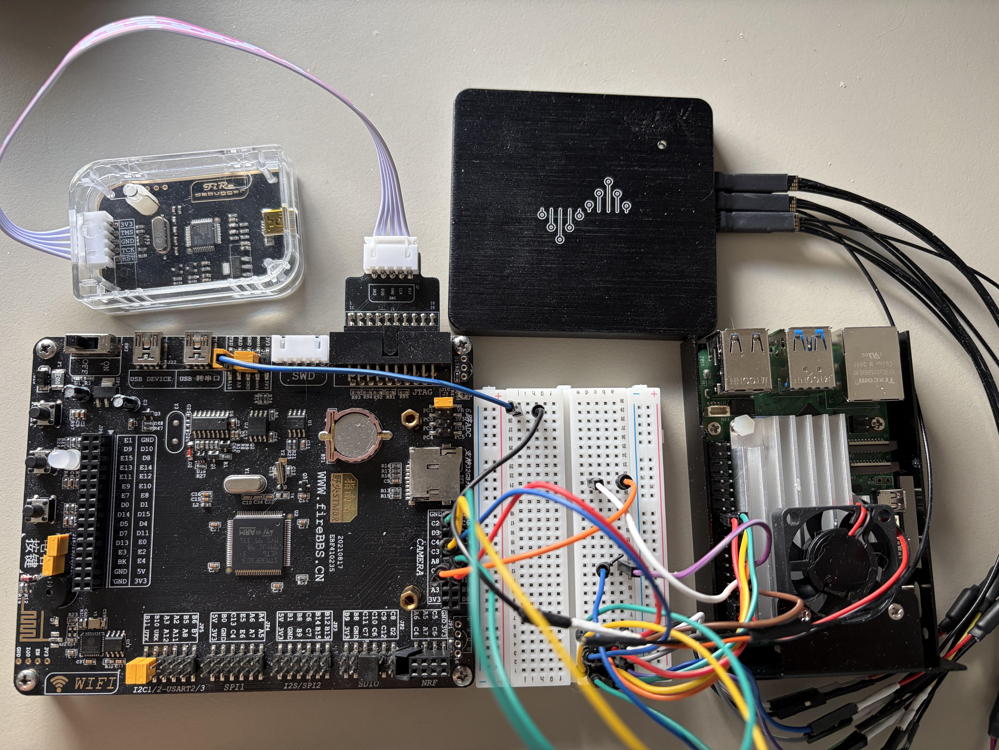
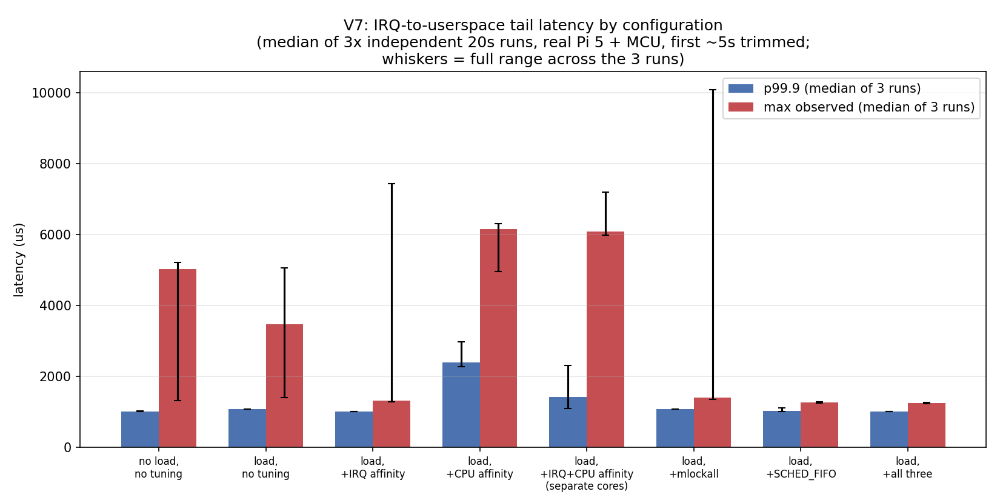
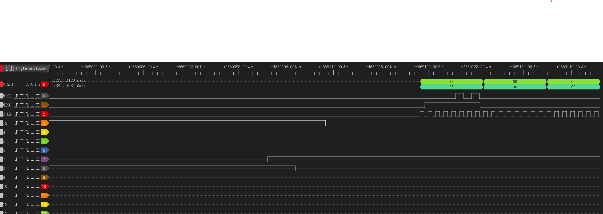

# Embedded Linux Device Platform

A reproducible Embedded Linux device platform integrating a custom
MCU-based acquisition peripheral with Linux over SPI and GPIO
interrupts: firmware, Device Tree, kernel driver, C++ device service,
Yocto image, and end-to-end performance diagnostics — all verified on
real hardware, not simulated.



```
┌────────────────────────────────┐
│  MCU Acquisition Peripheral    │  STM32F103, bare-metal C
│  Timer → sample → FIFO         │  Custom SPI register protocol
│  SPI slave + DATA_READY GPIO   │  (DEVICE_ID/CONTROL/FIFO_LEVEL/DATA)
└───────────────┬─────────────────┘
                │ SPI + GPIO IRQ  (measured: ~3.5us MCU → hard-IRQ)
                ▼
┌────────────────────────────────┐
│  Raspberry Pi 5 — Linux         │
│  Yocto/OpenEmbedded image       │
│  Device Tree overlay            │
│  Custom kernel driver           │  threaded IRQ, kfifo, sysfs diagnostics
│  /dev/acq0 (misc device)        │
└───────────────┬─────────────────┘
                │ read()/poll()   (measured: ~950-970us hard-IRQ → userspace)
                ▼
┌────────────────────────────────┐
│  C++17 Device Service           │  multithreaded, systemd-managed
│  Config / Metrics / Logging     │
│  Error recovery / liveness      │
└───────────────┬─────────────────┘
                │
                ▼
┌────────────────────────────────┐
│  Test & Performance Layer       │  Python integration + hardware stress
│  ftrace / logic analyzer        │  Repeated-measurement latency analysis
└────────────────────────────────┘
```

## Capabilities

| Area | Implementation |
| --- | --- |
| Firmware | STM32F103 bare-metal C, custom SPI register protocol with pipelined echo verification |
| HW interface | SPI (5-byte framed protocol) + GPIO interrupt, both edges verified with a logic analyzer |
| Embedded Linux | Custom Yocto/OpenEmbedded (Scarthgap) image, `bitbake`-built, boots to a working system on real Raspberry Pi 5 hardware |
| Kernel | Device Tree overlay + out-of-tree SPI driver: threaded IRQ (hard-IRQ timestamping + threaded FIFO drain), `kfifo`-backed buffer, sysfs diagnostics |
| Userspace | Multithreaded C++17 device service — acquisition worker, ring buffer, structured logging, metrics, config-driven scheduling knobs, systemd unit |
| Testing | Python integration tests against real hardware, sustained hardware stress tests, unit tests for pure logic |
| Debugging | 6 documented root-cause investigations (`docs/debugging/`) spanning IRQ priority inversion, protocol race conditions, stale-buffer bugs, and a systematic (if not fully conclusive) elimination process on an intermittent SPI-controller stall |
| Performance | Full-chain latency characterization (MCU-produced → hard-IRQ → userspace) with repeated-measurement statistical validation, not single-run numbers |

## Results





- **Throughput**: ~1000 samples/sec sustained, matching the MCU's production ceiling, after root-causing and fixing a driver-level SPI framing bottleneck.
- **Full-chain latency**: MCU-produced-to-hard-IRQ is ~3.5us (median), hard-IRQ-to-userspace is ~950-970us (median) — the electrical/interrupt-delivery segment is under 0.4% of total latency; the bottleneck is entirely in the software path after the interrupt fires.
- **Scheduling**: every configuration in an 8-way comparison matrix (baseline / CPU affinity / IRQ affinity / `mlockall` / `SCHED_FIFO` / combined) was measured 3x independently — the first-pass single-run conclusions did not hold up and were revised in place with the corrected data kept visible alongside the originals. `SCHED_FIFO`'s real, repeatable effect turned out to be eliminating rare severe scheduling-latency outliers, not shrinking an always-present tail.
- Full write-up, methodology, and all raw CSVs: [`docs/performance.md`](docs/performance.md) and [`results/`](results/).

## Repository layout

```
v1-spi-slave-handshake/   MCU firmware (STM32CubeIDE project)
device-tree/              Device Tree overlay source
driver/custom-acq/        Kernel driver + code walkthrough
userspace/device-service/ C++17 device service
tests/                    unit / integration / hardware test suites
yocto/meta-device-platform/  Custom Yocto layer (driver, service, image recipes)
experiments/scheduler-baseline/  Standalone cyclictest-style RT probe
docs/                     Performance report, debugging case studies, walkthroughs
results/                  Raw latency/throughput data, charts, logic-analyzer captures
```

## Build & Run

- MCU firmware: `v1-spi-slave-handshake/v1.3/MCU_v1-MCU-device-control/build-flash.sh` (STM32CubeIDE/CMake + OpenOCD)
- Kernel driver + device service: built as part of the Yocto image — see `yocto/meta-device-platform/`; each component also has a standalone build path documented in its own directory.
- Full device tree, wiring, and bring-up instructions: [`device-tree/README.md`](device-tree/README.md)
- Debugging case studies (root-cause investigations, not just fixes): [`docs/debugging/`](docs/debugging/)
