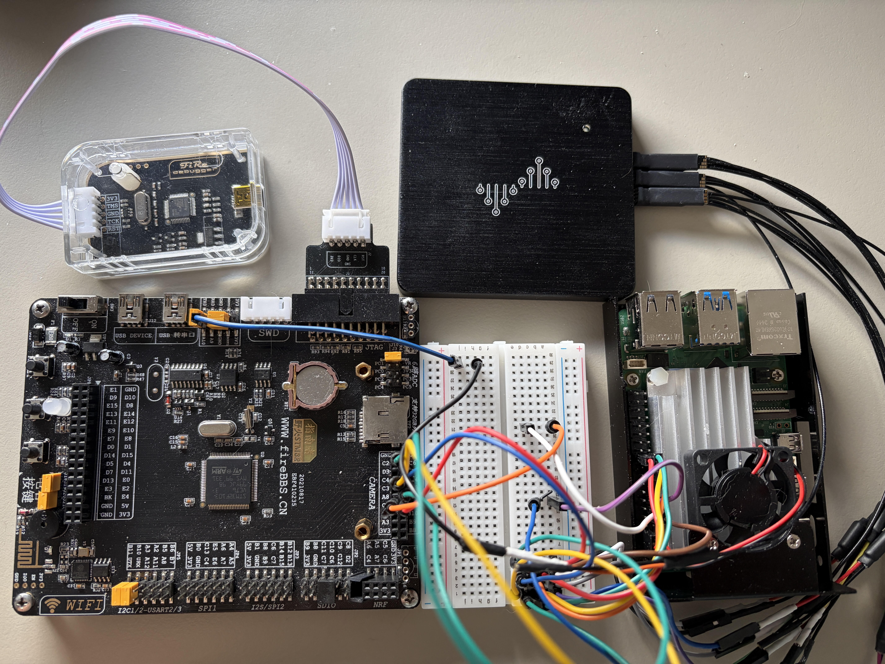
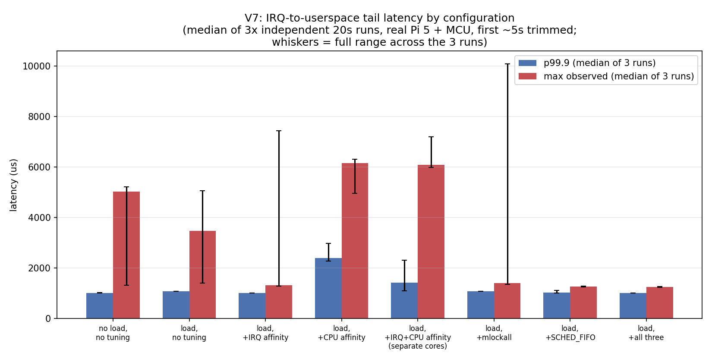
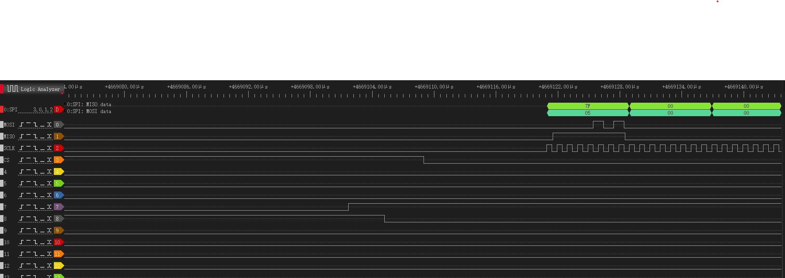

# Embedded Linux Device Platform

A reproducible Embedded Linux device platform integrating a custom
MCU-based acquisition peripheral with Linux over SPI and GPIO
interrupts: firmware, Device Tree, kernel driver, C++ device service,
Yocto image, and end-to-end performance diagnostics — all verified on
real hardware, not simulated.



```
┌────────────────────────────────┐
│  MCU Acquisition Peripheral    │  STM32F103, bare-metal C
│  Timer → sample → FIFO         │  Custom SPI register protocol
│  SPI slave + DATA_READY GPIO   │  (DEVICE_ID/CONTROL/FIFO_LEVEL/DATA)
└───────────────┬─────────────────┘
                │ SPI + GPIO IRQ  (measured: ~3.5us MCU → hard-IRQ)
                ▼
┌────────────────────────────────┐
│  Raspberry Pi 5 — Linux         │
│  Yocto/OpenEmbedded image       │
│  Device Tree overlay            │
│  Custom kernel driver           │  threaded IRQ, kfifo, sysfs diagnostics
│  /dev/acq0 (misc device)        │
└───────────────┬─────────────────┘
                │ read()/poll()   (measured: ~950-970us hard-IRQ → userspace)
                ▼
┌────────────────────────────────┐
│  C++17 Device Service           │  multithreaded, systemd-managed
│  Config / Metrics / Logging     │
│  Error recovery / liveness      │  rate backpressure, acts before loss
└───────────────┬─────────────────┘
                │ devbus          (measured: ~5us, any payload size)
                ▼
┌────────────────────────────────┐
│  devbus: zero-copy pub/sub      │  C++20, POSIX shared memory
│  loan/send, no copy at all      │  lock-free per-subscriber queues
│  per-subscriber drop policy     │  crash reclaim via pidfd
└───────────────┬─────────────────┘
                │
                ▼
┌────────────────────────────────┐
│  Consumers (N processes)        │  each picks its own overflow policy
└────────────────────────────────┘

┌────────────────────────────────┐
│  Test & Performance Layer       │  Python integration + hardware stress
│  ftrace / logic analyzer        │  Repeated-measurement latency analysis
└────────────────────────────────┘
```

## Capabilities

| Area | Implementation |
| --- | --- |
| Firmware | STM32F103 bare-metal C, custom SPI register protocol with pipelined echo verification |
| HW interface | SPI (5-byte framed protocol) + GPIO interrupt, both edges verified with a logic analyzer |
| Embedded Linux | Custom Yocto/OpenEmbedded (Scarthgap) image, `bitbake`-built, boots to a working system on real Raspberry Pi 5 hardware |
| Kernel | Device Tree overlay + out-of-tree SPI driver: threaded IRQ (hard-IRQ timestamping + threaded FIFO drain), `kfifo`-backed buffer, sysfs diagnostics |
| Userspace | Multithreaded C++17 device service — acquisition worker, ring buffer, structured logging, metrics, config-driven scheduling knobs, systemd unit |
| Testing | Python integration tests against real hardware, sustained hardware stress tests, unit tests for pure logic |
| Debugging | 9 documented root-cause investigations (two of which a second platform later corrected, with the corrections kept alongside the originals) (`docs/debugging/`) spanning IRQ priority inversion, protocol race conditions, stale-buffer bugs, an intermittent SPI-controller stall, and two real-time pitfalls found on the target (RT throttling, RCU starvation under PREEMPT_RT) |
| Performance | Full-chain latency characterization (MCU-produced → hard-IRQ → userspace) with repeated-measurement statistical validation, not single-run numbers |
| Middleware | `devbus`: zero-copy shared-memory pub/sub between processes on the device (loan/send, per-subscriber lock-free queues and drop policies, crash reclaim via pidfd), measured against Unix sockets |
| Real-time | Self-built PREEMPT_RT and non-RT kernels from one source, booted on the target through one-shot `tryboot`; kernel × tuning latency matrix with `cyclictest` alongside |
| Cross-platform | The same source and the same board on two Linux distributions and six kernels (self-built and vendor), to separate what the kernel contributes from what the image does — see [`platforms/`](platforms/) |

## Results






- **Throughput**: ~1000 samples/sec sustained and loss-free at the MCU's configured rate, after root-causing a driver-level SPI framing bottleneck. The pipeline's actual ceiling is ~1680/s, and it turned out to be set by one driver parameter rather than by the hardware: at the old `inter_frame_us` default the same link collapsed at ~1255/s. Both numbers are cliffs, not slopes — one 20 Hz step either side.
- **Full-chain latency**: MCU-produced-to-hard-IRQ is ~3.5us (median), hard-IRQ-to-userspace is ~950-970us (median) — the electrical/interrupt-delivery segment is under 0.4% of total latency; the bottleneck is entirely in the software path after the interrupt fires.
- **Scheduling**: every configuration in an 8-way comparison matrix (baseline / CPU affinity / IRQ affinity / `mlockall` / `SCHED_FIFO` / combined) was measured 3x independently — the first-pass single-run conclusions did not hold up and were revised in place with the corrected data kept visible alongside the originals. `SCHED_FIFO`'s real, repeatable effect turned out to be eliminating rare severe scheduling-latency outliers, not shrinking an always-present tail.
- **Zero copy**: on the Pi 5, a 4 MiB payload reaches another process in the same ~5 µs as a 64-byte one; copying it once costs ~600 µs, a Unix socket ~1.3 ms.
- **End to end with the middleware**: MCU → driver → `acq-bridge` → devbus → consumer measures 973 µs median (from the driver's hard-IRQ timestamp), with zero sequence gaps over 25 000 samples — the same as the driver-only path, i.e. the pub/sub hop costs single-digit microseconds.
- **Real-time**: `PREEMPT_RT` cut an untuned consumer's p99.9 latency under load ~100× (3 988 µs → 34 µs). With the critical path isolated and prioritized, all three kernels landed in the same 50-140 µs band — isolation mattered more than the preemption model. Details: [`docs/devbus-experiments.md`](docs/devbus-experiments.md).
- **Replicated on a second platform**: the whole matrix was rerun on a different distribution (Raspberry Pi OS) using Raspberry Pi's own kernels rather than ones built here. RT's benefit replicated within a few percent (3 959 µs → 38 µs), and the two distributions differed by **0.7%** on p99.9 under load — for this workload the kernel accounts for nearly all the latency, the image for nearly none. Running it twice also corrected two earlier conclusions of this project. See [`platforms/`](platforms/).
- **Backpressure that acts before data is lost**: the pipeline's cliff is sharp, but median latency climbs ~11× *before* throughput, sequence gaps or the driver's overflow counter move at all (second chart above). Feeding that leading signal into the rate controller held the MCU at a working point 6% below the cliff for 25 s with the lagging counters reading exactly zero. Picking the right statistic took two wrong ones, both caught on hardware and both written up.
- Full write-up, methodology, and all raw CSVs: [`docs/performance.md`](docs/performance.md) and [`results/`](results/). Charts regenerate from the committed CSVs (`tools/plot-platforms.py`), so a number in the text and a number in a picture cannot drift apart.

## Repository layout

```
v1-spi-slave-handshake/   MCU firmware (STM32CubeIDE project)
device-tree/              Device Tree overlay source
driver/custom-acq/        Kernel driver (see its README) + code walkthrough
userspace/device-service/ C++17 device service
userspace/devbus/         Zero-copy shared-memory pub/sub middleware (see its README)
tests/                    unit / integration / hardware test suites
yocto/meta-device-platform/  Custom Yocto layer (driver, service, image recipes)
experiments/scheduler-baseline/  Standalone cyclictest-style RT probe
experiments/rt-kernel/    PREEMPT_RT kernel build + safe tryboot deployment for the Pi 5
platforms/                The two Linux distributions this runs on, and how they differ
docs/                     Performance report, debugging case studies, walkthroughs
results/                  Raw latency/throughput data, charts, logic-analyzer captures
```

## Build & Run

- MCU firmware: `v1-spi-slave-handshake/v1.3/MCU_v1-MCU-device-control/build-flash.sh` (STM32CubeIDE/CMake + OpenOCD)
- Kernel driver + device service: built as part of the Yocto image — see `yocto/meta-device-platform/`; each component also has a standalone build path documented in its own directory.
- Full device tree, wiring, and bring-up instructions: [`device-tree/README.md`](device-tree/README.md)
- Debugging case studies (root-cause investigations, not just fixes): [`docs/debugging/`](docs/debugging/README.md) — indexed, one line each
