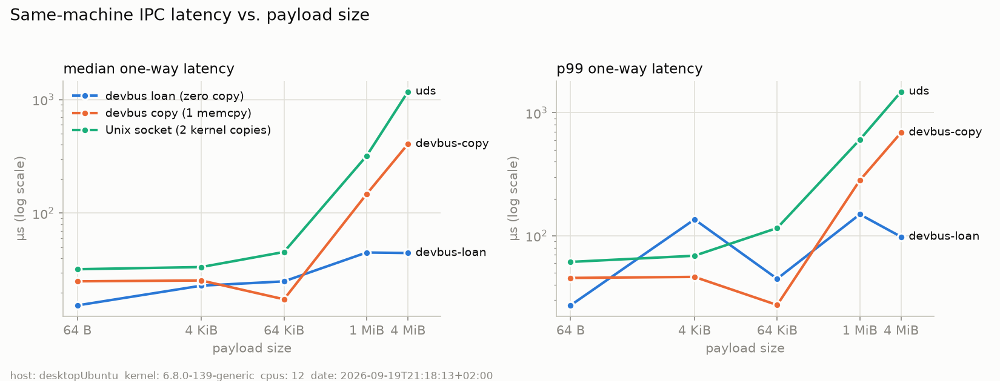
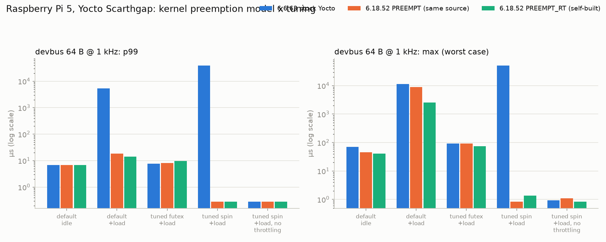
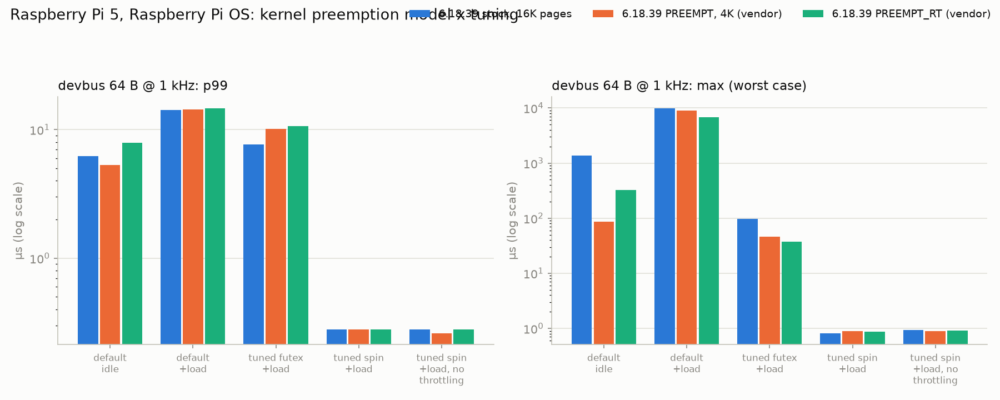
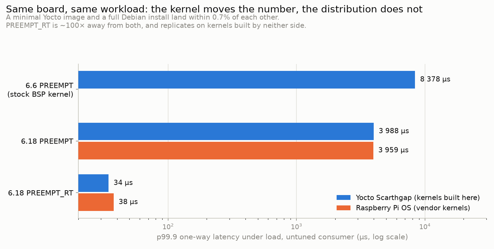
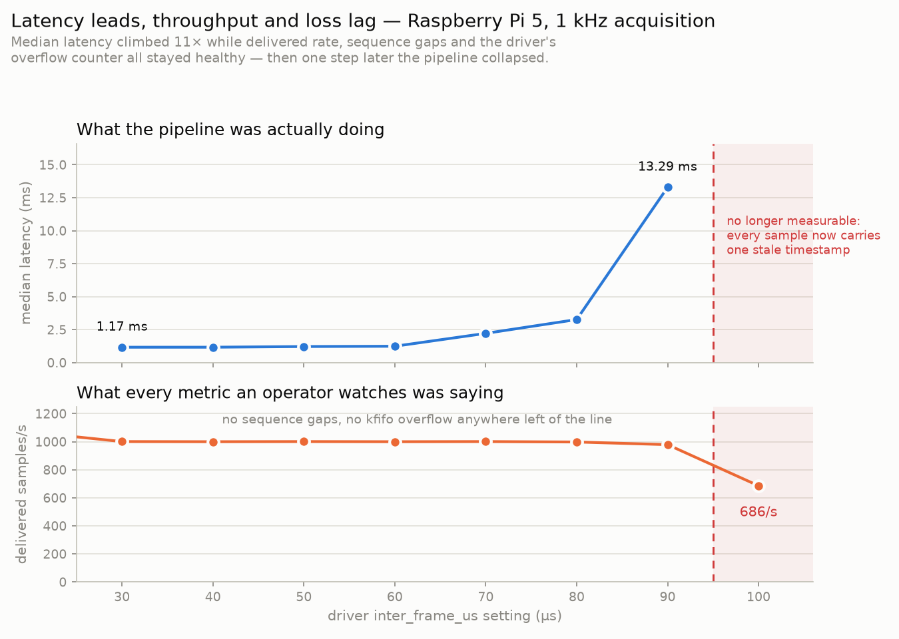

# devbus experiments

Four questions every in-device middleware has to answer, each measured
with `userspace/devbus/bench/devbus-bench` (`bench/run_all.sh` runs all of
them). Raw CSVs: `results/devbus/<platform>/`.

> **Two sets of numbers.** Sections 1-4 were measured on the development
> host. The [Raspberry Pi 5 section](#raspberry-pi-5-three-kernels-including-preempt_rt)
> has the target numbers, on three kernels. Quote those as device numbers.
>
> **Where sections 1-4 come from:** a desktop dev host (AMD Ryzen 5 4500,
> Ubuntu 24.04, kernel 6.8, `powersave` governor, not isolated). They show
> **relative behavior and shape**, not what the target will do. The same
> script runs unchanged on the Raspberry Pi 5. The Pi numbers, with and
> without PREEMPT_RT / `SCHED_FIFO`, are the ones to quote as device numbers.

Method notes that apply to every experiment:
- **One-way latency.** The sender stamps `CLOCK_MONOTONIC` into the
  payload; the receiver subtracts its own `CLOCK_MONOTONIC`. Both ends run
  on the same machine, so both read the same clock.
- **Separate processes.** Publisher and subscriber are separate processes
  (`fork()`), except in the in-process queue comparison.
- **Pacing.** Senders pace with absolute-deadline `clock_nanosleep`, so the
  loop's own overhead doesn't accumulate as drift.
- **No drops in the latency runs.** Latency runs use the `Block` policy with
  a long timeout, so nothing is dropped and every sample is counted.

## 1. Does zero copy pay off, and from what size?

Three ways to get a payload from one process to another, same payload,
same rate. For the Unix socket, "copy" means into the kernel and back out
again.

| transport | what moves | copies |
| --- | --- | --- |
| `devbus-loan` | 4-byte chunk index; the payload was produced in shared memory | 0 |
| `devbus-copy` | payload `memcpy`'d from private memory into a loaned chunk | 1 |
| `uds` | payload written to / read from a `SOCK_STREAM` Unix socket | 2 (user→kernel→user) |



Median one-way latency, µs (3 runs for 1 MiB and 4 MiB, 1 run below that):

| payload | devbus-loan | devbus-copy | uds |
| --- | --- | --- | --- |
| 64 B | 15 | 25 | 32 |
| 4 KiB | 23 | 26 | 34 |
| 64 KiB | 25 | 17 | 45 |
| 1 MiB | 45 / 34 / 34 | 147 / 197 / 144 | 319 / 359 / 325 |
| 4 MiB | 45 / 28 / 43 | 406 / 489 / 377 | 1174 / 1182 / 1085 |

- **Zero copy makes latency independent of payload size.** At 4 MiB the
  loaned path delivers in about the same time as at 64 B. The copying
  paths grow with the payload, roughly with memory bandwidth.
- **Below ~64 KiB, all three are within noise of each other.** Here the
  cost is not the data but waking a sleeping process (next section). Zero
  copy is worth its complexity for frames and sample blocks, not for
  16-byte samples.
- **Tails on this host are noisy.** A single run had a 4 MiB `devbus-loan`
  p99 of 2 ms while its median stayed at 28 µs. Tail claims wait for the Pi
  with an isolated core.

## 2. Waiting: latency vs. CPU

64-byte samples, `devbus-loan`, one subscriber process.

| wait mode | rate | p50 µs | p99 µs | subscriber CPU |
| --- | --- | --- | --- | --- |
| busy-spin | 1 kHz | 0.36 | 0.40 | 100 % |
| busy-spin | 10 kHz | 0.20 | 0.27 | 100 % |
| yield | 1 kHz | 0.61 | 1.04 | 100 % |
| yield | 10 kHz | 0.54 | 0.96 | 100 % |
| futex | 1 kHz | 15.6 | 25.6 | 1.2 % |
| futex | 10 kHz | 5.6 | 7.3 | 4.2 % |

- **Spinning buys roughly 50x lower latency for a whole core.** On a
  4-core device that is 25 % of the machine for one subscriber, so it's
  only worth it for the one consumer on the hard real-time path, pinned to
  an isolated core.
- **With futex, slower publishing makes each wake-up slower** (15.6 µs at
  1 kHz vs. 5.6 µs at 10 kHz). With longer gaps the idle core drops into
  deeper C-states, and waking from those costs more. The usual RT fixes
  (`/dev/cpu_dma_latency`, disabling deep C-states on the RT core) belong
  in the Pi PREEMPT_RT experiment.
- The publisher makes the `FUTEX_WAKE` syscall only when the subscriber
  is actually asleep, so spinning subscribers cost it nothing.

## 3. Lock vs. lock-free, in-process

The baseline is `device-service`'s own `RingBuffer` (mutex + two condition
variables, capacity 16), against devbus's ring used between two threads.

| impl | unpaced throughput | p50 µs @ 10 kHz | p99 µs @ 10 kHz (3 runs) | consumer CPU @ 10 kHz |
| --- | --- | --- | --- | --- |
| mutex + condvar | 1.68 M msg/s | 6.7 / 5.4 / 6.3 | 10.6 / 22.2 / 22.2 | 4.9 % |
| devbus, futex | 1.98 M msg/s | 6.9 / 5.7 / 6.1 | 20.6 / 20.9 / 20.0 | 5.3 % |
| devbus, spin | 2.73 M msg/s | 0.21 | 0.87 | 100 % |

- The lock-free ring wins on raw throughput (+17 %, even though it also
  does cross-process bookkeeping the mutex version doesn't). **At the
  device's real rate (10 kHz), lock vs. no lock makes no measurable
  difference.** Both are dominated by the sleep/wake round trip.
- The first single run showed devbus-futex with a much worse p99.9 than
  the mutex version (147 vs. 23 µs). The repeats didn't reproduce the gap
  (74 vs. 50, then 28 vs. 92, i.e. it flipped). This is the same lesson as the M1 scheduler matrix: a
  single run can mislead.
- So the reason to replace `RingBuffer` is not speed. It's that the lock-free
  ring works **across processes** and in shared memory, where a mutex
  would need `PTHREAD_PROCESS_SHARED` + robust-mutex crash handling.

## 4. Does a slow consumer hurt everyone else?

Publisher at 5 kHz for 3 s. A fast "critical" subscriber (`Block`, must
see everything). A slow subscriber that takes 1 ms per sample, so it can
keep up with at most 1 kHz. Only the slow subscriber's policy changes.

| slow policy | publisher achieved | publisher `send()` p99 | fast: received / gaps | slow: received / drops (gaps · publisher counter) |
| --- | --- | --- | --- | --- |
| DropOldest | 5000 Hz | 4.4 µs | 15001 / 0 | 2815 / 12188 · 12188 |
| DropNewest | 5000 Hz | 1.7 µs | 15001 / 0 | 2882 / 12117 · 12184 |
| Block (5 ms timeout) | **931 Hz** | **1063 µs** | 15001 / 0 | 14999 / 2 · 2 |

(repeat 2: DropOldest 5000 Hz, DropNewest 5000 Hz, Block 941 Hz; repeat 3: DropOldest 5000 Hz, DropNewest 5000 Hz, Block 940 Hz. The DropOldest gap count matched the publisher counter exactly in all three runs: 12188, 12175, 12177.)

- **With a drop policy, the slow consumer is fully isolated.** The
  publisher holds 5 kHz, `send()` stays in the low microseconds, and the
  fast consumer gets every sample.
- **With `Block`, the slowest consumer sets the pace for the whole
  system.** The publisher drops to the slow consumer's ~1 kHz, and the
  fast consumer, although it loses nothing, now receives at ~1 kHz too.
  This is the classic "slowest subscriber stalls everyone" failure mode of
  pub/sub systems that choose never to drop. It's the right behavior
  only when losing data is worse than slowing the source down, and then
  the timeout is what bounds the damage.
- **Drop accounting reconciles.** For DropOldest, the subscriber's own gap
  count equals the publisher's counter exactly, in every run. For
  DropNewest they differ by the drops after the last received sample (the
  tail, which a gap counter can't see by construction). The unit tests
  check the exact identity `delivered = received + evicted`.

## What this means for the device

- `acq/samples` (16-byte samples at 1 kHz) doesn't need zero copy for
  speed. It needs the **isolation and accounting**: per-consumer policies
  and drops counted on both sides.
- Zero copy starts to matter at the M2 FPGA/DMA stage (blocks of samples,
  frames).
- The latency floor for a sleeping consumer is the kernel wake-up, not
  the queue. That is the next thing to measure on the Pi, under
  PREEMPT_RT with `SCHED_FIFO` and a pinned core.

---

## Raspberry Pi 5, Yocto Scarthgap: three kernels, including PREEMPT_RT

The same experiments on the target: Raspberry Pi 5 (4× Cortex-A76,
2.4 GHz), the project's Yocto Scarthgap image, WiFi, and the MCU link idle.
Three kernels were booted one after another on the same card through the
firmware's one-shot **tryboot**, so the stock kernel was never at risk
(`experiments/rt-kernel/`):

| kernel | preemption | `nohz_full` / `rcu_nocbs` |
| --- | --- | --- |
| 6.6.63-v8-16k (stock Yocto) | `PREEMPT` | not compiled in, so ignored (case 09) |
| 6.18.52-devbus-std-iso (built here) | `PREEMPT` | enabled |
| 6.18.52-devbus-rt-iso (built here) | **`PREEMPT_RT`** | enabled |

Both 6.18 kernels come from the same `rpi-6.18.y` source and the same
`bcm2712_defconfig`. The **only** difference is `CONFIG_PREEMPT_RT`. All
three booted with the same command line: `isolcpus=2,3 nohz_full=2,3
rcu_nocbs=2,3 irqaffinity=0,1`. Load is `stress-ng --cpu 2 --vm 1
--vm-bytes 128M --switch 1 --timer 1`, on the housekeeping cores 0-1.
Every devbus row below is 60 000 samples (64 B at 1 kHz for 60 s). The
three "under load" numbers the comparison rests on were measured 3 times
per kernel.

Configurations:
- **default**: no tuning, `SCHED_OTHER`, no pinning (so it shares cores
  0-1 with the load).
- **tuned**: publisher on core 2, subscriber on core 3, both
  `SCHED_FIFO` 80, `mlockall`, `/dev/cpu_dma_latency` = 0, `performance`
  governor.
- **spin** / **futex**: the subscriber's wait mode.



### Worst case under load, 3 runs each (max µs)

| kernel | cyclictest (FIFO 90, core 3) | devbus, default | devbus, tuned (futex) |
| --- | --- | --- | --- |
| 6.6 stock | 97 / 80 / 91 | 11 436 / 10 705 / 9 420 | 92 / 80 / 75 |
| 6.18 PREEMPT | 137 / 102 / 100 | 8 949 / 10 871 / 8 815 | 91 / 116 / 99 |
| 6.18 **PREEMPT_RT** | 89 / 110 / 95 | **2 566 / 4 597 / 3 211** | 75 / 50 / 91 |

p99.9 for the untuned default under load: **3 988 µs (PREEMPT) vs.
34 µs (PREEMPT_RT)**, about 100×.

What this says, honestly:

1. **PREEMPT_RT's real win is for code that isn't carefully tuned.** An
   ordinary `SCHED_OTHER` consumer sharing cores with load had its p99.9
   drop ~100× and its worst case ~3× on RT, consistently across runs.
   On a device where not every process can be pinned and prioritized,
   that's the argument for RT.
2. **Once the critical path is isolated and prioritized, the preemption
   model barely matters for this workload.** Tuned devbus and cyclictest
   land in the same 50-140 µs band on all three kernels, and the ranges
   overlap. Isolation (`isolcpus` + `SCHED_FIFO` + `mlock` +
   `cpu_dma_latency`) takes the default-under-load worst case from ~10 ms
   down to ~0.1 ms, a 100× improvement that needs no kernel change. This
   agrees with M1 ([case 07](debugging/case-07-preempt-rt-comparison-exposes-a-different-bottleneck.md)).
3. **RT costs median latency.** Idle and untuned, the median one-way
   latency is 6.1 µs on RT vs. 3.9 µs on the same-source PREEMPT kernel.
   Threaded interrupts and sleeping spinlocks buy a bounded worst case
   with a slower average. That's the classic RT trade-off, measured.
4. **Busy-spinning got under 1.5 µs worst case on every kernel, but only
   after two separate kernel-level fixes:** RT throttling on 6.6
   ([case 08](debugging/case-08-busy-spin-subscriber-hit-by-rt-throttling.md))
   and RCU starvation on PREEMPT_RT without `nohz_full`
   ([case 09](debugging/case-09-preempt-rt-busy-spin-starves-rcu.md)).

### Zero copy on the target

Idle, default configuration, median one-way latency in µs:

| payload | devbus-loan (6.6 / 6.18 / RT) | devbus-copy (6.6 / 6.18 / RT) | Unix socket (6.6 / 6.18 / RT) |
| --- | --- | --- | --- |
| 64 B | 4.4 / 3.9 / 6.2 | 4.4 / 3.9 / 6.2 | 5.3 / 4.7 / 9.2 |
| 64 KiB | 4.4 / 3.9 / 6.2 | 8.4 / 7.9 / 12.2 | 18.7 / 16.4 / 25.8 |
| 1 MiB | 4.6 / 5.2 / 6.6 | 177 / 124 / 146 | 257 / 288 / 246 |
| 4 MiB | 4.6 / 5.2 / 6.5 | 615 / 601 / 620 | 1 261 / 1 510 / 1 599 |

On the Pi the zero-copy result is cleaner than on the dev host: **4 MiB
arrives in the same ~5 µs as 64 bytes**, on every kernel. Copying once
costs ~600 µs at 4 MiB, and the socket path 1.3-1.6 ms.

### Slow-subscriber isolation on the target (tuned + load)

| kernel | slow policy | publisher rate | fast subscriber max |
| --- | --- | --- | --- |
| 6.6 stock | DropOldest | 5000 Hz | 69 µs |
| 6.6 stock | Block | 933 Hz | **52 534 µs** (RT throttling, case 08) |
| 6.18 PREEMPT | Block | 951 Hz | 5 017 µs (= block timeout) |
| 6.18 PREEMPT_RT | DropOldest | 5000 Hz | 46 µs |
| 6.18 PREEMPT_RT | Block | 943 Hz | 5 004 µs (= block timeout) |

Same conclusion as on the dev host: drop policies isolate the slow
consumer completely, while `Block` hands the whole system the slow
consumer's rate. DropOldest drop accounting reconciled exactly on every
kernel (gap count = publisher counter).

### Also verified on the target

- The unit tests pass on aarch64: 30 consecutive runs, 15 tests each.
  The lock-free rings are exercised under ARM's weaker memory model,
  where x86 would hide ordering bugs.
- Raw data per kernel: `results/devbus/pi5-yocto/<release>/` (CSV,
  cyclictest histograms, `dmesg`, `host.txt` with the exact command line
  and governor state).

---

## End to end on real hardware (Yocto card)

With the MCU powered, the whole chain runs on the Pi 5 (stock 6.6 kernel,
no core isolation, ordinary desktop-grade conditions):

```
STM32F103 --SPI--> custom-acq driver --/dev/acq0--> acq-bridge --devbus--> consumers
                   (hard IRQ stamps irq_ts_ns)      SCHED_FIFO 80, core 2
```

`acq-bridge` reads each 16-byte sample straight into a loaned
shared-memory chunk, so the kernel's `copy_to_user()` is the only copy
in the path, no matter how many consumers attach. Two consumers ran at
once for 25 s at 1 kHz:

| consumer | policy | rate | gaps | latency p50 | p99 | max |
| --- | --- | --- | --- | --- | --- | --- |
| fast (SCHED_FIFO 70, core 3) | DropOldest | 1000/s | **0** | **973 µs** | 976 µs | 977-1006 µs |
| slow (3 ms of work per sample, untuned) | DropNewest | 328/s | 13 687 | 3 123 753 µs | — | — |

The latency is measured from `irq_ts_ns`, stamped by the driver's
hard-IRQ handler, so it covers the entire path.

- **The middleware hop is free at this scale.** 973 µs matches the
  driver-only path measured in V7 (hard-IRQ to userspace, ~950-970 µs
  median). Adding a second process and a pub/sub layer costs single-digit
  microseconds on top. The bottleneck is still the driver's threaded SPI
  drain, exactly as `docs/performance.md` says.
- **Zero drops end to end**: `kfifo_overflow`, `spi_error_count` and
  `spi_rearm_fail` all stayed 0, and the fast consumer saw 25 002
  consecutive sequence numbers with no gaps.
- **The slow consumer shows what `DropNewest` really means.** It keeps a
  complete, ordered history, so what it is processing is **3.1 seconds
  old** (a 1024-deep queue drained at 328/s). Its own gap count (13 687)
  and the publisher's counter agree. A consumer that needs fresh data
  wants `DropOldest`; one that needs an unbroken record wants
  `DropNewest` and must be sized for the lag. This is the per-subscriber
  policy choice, visible in one run.

---

## Raspberry Pi 5, Raspberry Pi OS: the same tests on vendor kernels

Same board, same MCU, same static binaries — a different SD card holding
a full Debian trixie install and Raspberry Pi's **own** kernels from
`apt`, instead of a minimal Yocto image and kernels built here. Why both
platforms exist, and what else differs between them:
[`platforms/`](../platforms/).

Three kernels, again one at a time through one-shot `tryboot`
(`experiments/rt-kernel/run_on_pios.sh`), all with
`isolcpus=2,3 nohz_full=2,3 rcu_nocbs=2,3 irqaffinity=0,1`:

| kernel | preemption | pages | role |
| --- | --- | --- | --- |
| 6.18.39+rpt-rpi-2712 | `PREEMPT` | 16K | what the card boots by default |
| 6.18.39+rpt-rpi-v8 | `PREEMPT` | 4K | the non-RT control |
| 6.18.39+rpt-rpi-v8-rt | **`PREEMPT_RT`** | 4K | vendor RT flavour |

**The default kernel is not the control.** Raspberry Pi ships RT only as
a `v8` build, and `v8` uses 4K pages while the Pi 5's default `2712`
build uses 16K. Comparing `2712` against `v8-rt` would vary the page
size and the preemption model at once, so `v8` — identical to `v8-rt`
except for `CONFIG_PREEMPT_RT` — is the honest half of the pair, and
`2712` is reported as the shipped baseline.



### Worst case under load, 3 runs each (max µs)

| kernel | cyclictest (FIFO 90, core 3) | devbus, default | devbus, tuned (futex) |
| --- | --- | --- | --- |
| 6.18.39 stock, 16K | 63 / 97 / 76 | 9 929 / 8 908 / 10 501 | 96 / 119 / 87 |
| 6.18.39 v8, `PREEMPT` | 36 / 42 / 68 | 8 913 / 10 877 / 7 264 | 46 / 42 / 45 |
| 6.18.39 v8, **`PREEMPT_RT`** | 60 / 70 / 42 | **6 798 / 6 103 / 2 614** | 38 / 30 / 27 |

### The headline RT result replicates on a kernel we did not build

p99.9 for an untuned `SCHED_OTHER` consumer sharing cores with the load:

| | non-RT | PREEMPT_RT | ratio |
| --- | --- | --- | --- |
| Yocto card, kernels built here (6.18.52) | 3 988 µs | 34 µs | ~117× |
| Pi OS card, vendor kernels (6.18.39) | 3 959 µs | 38 µs | ~105× |

Two independently produced kernel pairs, two distributions, and the
numbers land within a few percent of each other. The RT median penalty
replicates too: idle, untuned, the one-way median is 6.9 µs on the
vendor RT kernel against 4.2 µs on its own non-RT control (Yocto card:
6.1 vs. 3.9). **This is the strongest form the conclusion has taken so
far** — it is a property of the preemption model, not of one build.

### Isolation cannot be completed on this platform

Both vendor kernels are built without `CONFIG_NO_HZ_FULL` and
`CONFIG_RCU_NOCB_CPU`, so `nohz_full=` and `rcu_nocbs=` are accepted on
the command line, logged once, and ignored:

```
[    0.000000] Unknown kernel command line parameters "... nohz_full=2,3 rcu_nocbs=2,3 ...", will be passed to user space.
$ cat /sys/devices/system/cpu/isolated     # 2-3      -> isolcpus worked
$ cat /sys/devices/system/cpu/nohz_full    # No such file
```

`isolcpus` works; tickless and RCU offload do not. **The complete
isolation configuration is not reachable from `apt` on this platform —
it requires building the kernel**, which is what the Yocto card does.
That is a concrete argument for the self-built path rather than a
preference for it.

It also reproduced [case 09](debugging/case-09-preempt-rt-busy-spin-starves-rcu.md)'s
RCU starvation exactly — three stalls in a 180 s busy-spin run — **while
the measured latency stayed at 3.85 µs worst case**. That split the
original case in two: the starvation was real, but its 130 ms cost was
the serial console printing the stall report, not the stall. See that
case's follow-up.

---

## The two platforms side by side

### How much of the latency is the kernel, and how much is the image?



This is the question the second card exists to answer. Untuned and under
load, the two distributions are indistinguishable; the preemption model
is what moves the number.

| devbus 64 B @ 1 kHz, under load | p99.9 | max (3 runs) |
| --- | --- | --- |
| Yocto, 6.6 stock | 8 377 µs | 11 436 / 10 705 / 9 420 |
| Yocto, 6.18 `PREEMPT` (built here) | 3 988 µs | 8 949 / 10 871 / 8 815 |
| Pi OS, 6.18 `PREEMPT` (vendor) | 3 959 µs | 8 913 / 10 877 / 7 264 |
| Yocto, 6.18 `PREEMPT_RT` (built here) | 34 µs | 2 566 / 4 597 / 3 211 |
| Pi OS, 6.18 `PREEMPT_RT` (vendor) | 38 µs | 6 798 / 6 103 / 2 614 |

The two 6.18 `PREEMPT` rows differ by **0.7%** on p99.9, on ranges that
overlap for the maximum — a minimal Yocto image and a full Debian with
journald, a package manager and a desktop-grade service set. For this
workload, **the image contributes almost nothing and the kernel
contributes nearly everything.**

That is worth stating plainly because the opposite is widely assumed. A
stripped image is justified by boot time, size, attack surface and
reproducibility. On this evidence it is not, by itself, justified by
latency.

Once tuned, both platforms land in the same band again (maximum over
three runs: 27-46 µs on the Pi OS `v8` pair, 87-119 µs on its 16K
default, 50-116 µs across the Yocto kernels), so the earlier conclusion
holds across distributions: **isolation and priority matter more than which
distribution or which preemption model**, and RT's real value is for
the code you cannot tune.

### What the second platform changed

| | before | after |
| --- | --- | --- |
| RT's benefit for untuned code | one kernel pair, built here | replicated on vendor kernels, ~105× vs ~117× |
| "This card only does ~650 samples/s" | an open question in case 07 | a module parameter past a cliff — [case 07 follow-up](debugging/case-07-preempt-rt-comparison-exposes-a-different-bottleneck.md) |
| "RCU starvation costs 130 ms" | case 09's conclusion | starvation reproduces, the 130 ms was the console — [case 09 follow-up](debugging/case-09-preempt-rt-busy-spin-starves-rcu.md) |
| Full core isolation | assumed available anywhere | needs a self-built kernel; vendor kernels silently drop it |

Two of the four rows are corrections to earlier conclusions of this
project. That is the argument for the second platform: **a result that
has only ever been produced on one machine has not been tested, it has
been observed.**

---

## End to end on the Raspberry Pi OS card, and a cliff worth knowing about

The full chain also runs on this card (stock 6.18.39 kernel, no
isolation, MCU at 1 kHz, 30 s, two consumers):

| consumer | policy | rate | gaps | p50 | p99 | max |
| --- | --- | --- | --- | --- | --- | --- |
| fast (FIFO 70, core 3) | DropOldest | 1 002/s | **0** | 1 191 µs | 2 167 µs | 2 179 µs |
| slow (3 ms/sample, untuned) | DropNewest | 327/s | 18 402 | 3.13 s | — | — |

`kfifo_overflow` and `spi_error_count` both stayed at 0 across the run.

Getting here required setting the driver's `inter_frame_us` below 100 µs
(this run used 50). At the default of 100 this card delivers 686/s
instead of ~1070/s — the long-standing puzzle from case 07, resolved in
that case's follow-up.

### Throughput is a lagging indicator; queue latency is a leading one



Sweeping the same parameter with the end-to-end chain running shows why
throughput alone is not enough to tell whether a pipeline has margin:

| `inter_frame_us` | rate | gaps | `kfifo_overflow` | **p50 latency** |
| --- | --- | --- | --- | --- |
| 30 | 1 001/s | 0 | 0 | 1 167 µs |
| 40 | 1 000/s | 0 | 0 | 1 168 µs |
| 50 | 1 001/s | 0 | 0 | 1 220 µs |
| 60 | 1 000/s | 0 | 0 | 1 242 µs |
| 70 | 1 001/s | 0 | 0 | **2 218 µs** |
| 80 | 998/s | 0 | 0 | **3 266 µs** |
| 90 | 979/s | 0 | 0 | **13 290 µs** |
| 100 | 686/s | — | 5 348 | — (collapsed) |

Every row through 90 µs looks healthy on the metrics an operator
normally watches: full rate, no gaps, no overflow. Meanwhile the median
latency has risen **11×**, because the driver is only just keeping up
and a standing backlog of ~13 samples has built up in the queue. One
step further and the pipeline collapses to the degraded regime.

This is the same shape `docs/performance.md`'s M0 section found on a
completely different axis — there, median latency climbed from 973 µs to
~1 720 µs while packet loss stayed at exactly 0% right up to the cliff.
Two independent axes, same signature: **latency leads, throughput and
loss lag.**

It also identifies the improvement M0's backpressure section left open.
That controller reacts to `kfifo_overflow`, which only moves once the
pipeline has already collapsed. Queue latency (or devbus's own
`Topic::pressured()`) starts rising at 70 µs here, three sweep points
and an 11× climb before the cliff at 100 µs — that gap is the room a
controller would have to act in, and it currently has none.

Raw data: [`results/devbus/pi5-raspios/`](../results/devbus/pi5-raspios/)
(per-kernel matrices, `e2e/`, and `ifus-sweep/` with the per-point logs).
