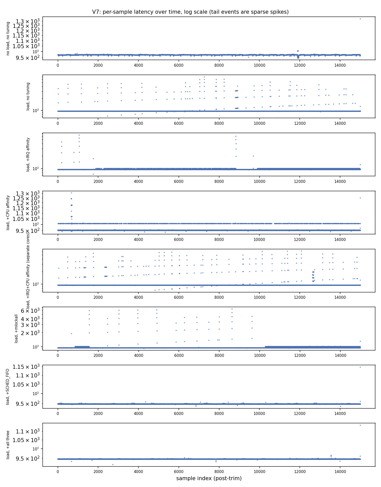
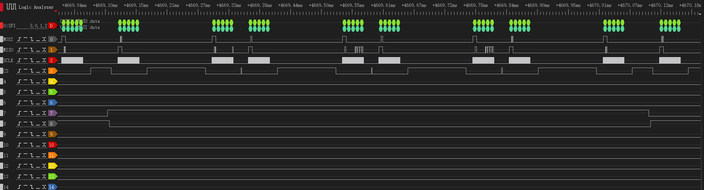
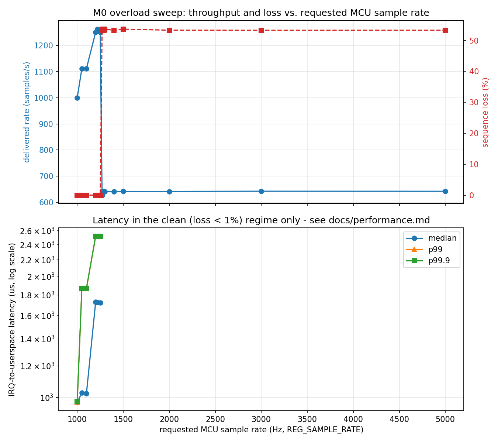
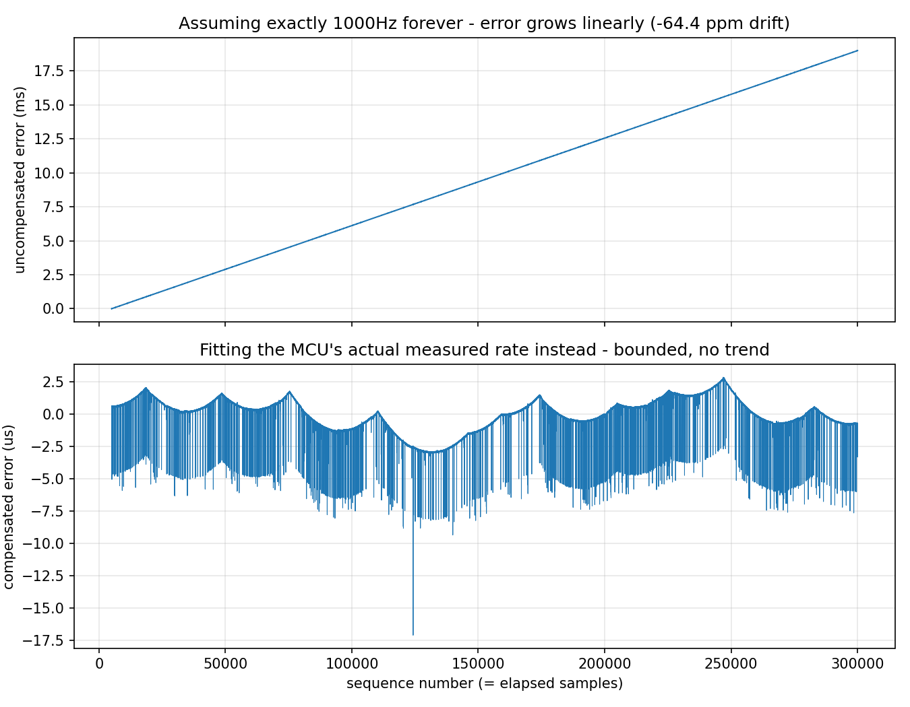

# V7: End-to-End Latency Under Load

What this measures: the IRQ-to-userspace segment of the acquisition
pipeline — from the driver's hard-IRQ timestamp (`irq_ts_ns`,
`driver/custom-acq/custom_acq.c`) to `device-service` receiving the
sample (`std::chrono::steady_clock`, the same underlying clock as the
kernel's `ktime_get`). The MCU-sample-produced-to-hard-IRQ segment
(the other half of the full chain) is covered separately below, added
2026-09-07 with a logic analyzer.

This metric was not trustworthy until the throughput fix below landed:
before it, `device-service` couldn't keep up with the MCU's production
rate, so `DATA_READY` rarely de-asserted and thousands of samples ended
up sharing one stale `irq_ts_ns` (see `private/session-log.md`'s
2026-09-04 entries for the full story). Everything here was measured
after that fix.

Reported as median / p99 / p99.9 / **maximum observed** — never "worst
case", since a finite run doesn't measure a theoretical upper bound, only
what actually happened during it.

## Prerequisite: the throughput fix

Each sample cost 3 register reads (`REG_FIFO_LEVEL` + `REG_DATA_SEQ` +
`REG_DATA_VAL`), each dominated by the driver's `inter_frame_us` SPI
frame gap. A hardware sweep (500/300/250/200/150/100/50/20/10/0us) found
a **non-monotonic** relationship — 200-300us was a worse "valley" (more
`kfifo_overflow`/sequence gaps) than either the old 500us default or
anything at/below ~100us. Default changed to 100us: throughput went from
~520 to ~1000 samples/sec, matching the MCU's apparent production
ceiling. Without this, the scheduler comparison below wouldn't have had
meaningful data to work with — see `docs/debugging/case-06-*.md`'s
updated "Next steps" for the full sweep table.

## Scheduler comparison

Real Pi 5 + real MCU, `device-service` run manually (not under systemd,
to control the config knobs directly — see `Config`'s
`lock_memory`/`sched_fifo_priority`/`cpu_affinity_core` fields, added
because this project's minimal Yocto image doesn't carry
`chrt`/`taskset`). Background load: four `yes > /dev/null &` processes,
one per core (this image doesn't carry `stress-ng`) — crude, but enough
to contend for CPU time against the acquisition thread. Each run: 20
seconds, first ~5000 samples (the first ~5s) trimmed to exclude startup
transients, raw CSVs in `results/latency/`.

| Config | median (us) | p99 (us) | p99.9 (us) | max observed (us) | sample loss |
|---|---|---|---|---|---|
| No load, no tuning (`baseline_noload`) | 972.5 | 974.7 | 976.5 | 1325.2 | 0 |
| **Under load**, no tuning (`baseline_load`) | 949.5 | 1211.2 | **4621.8** | **7018.0** | 0 |
| Under load, + IRQ affinity only (`irq_affinity_load`) | 952.1 | 1007.1 | 1734.3 | 6445.7 | 0 |
| Under load, + CPU affinity only (`affinity_load`) | 951.9 | 1007.2 | 1068.7 | 1303.9 | 0 |
| Under load, + IRQ affinity + CPU affinity, **separate cores** (`irq_and_cpu_affinity_load`) | 949.6 | 1872.9 | 4912.4 | 6187.9 | 0 |
| Under load, + mlockall only (`mlock_load`) | 945.7 | 1014.1 | 4202.2 | 6439.3 | 0 |
| Under load, + SCHED_FIFO only (`fifo_load`) | 947.9 | 949.7 | 951.8 | 1146.9 | 0 |
| Under load, all three combined (`all_load`) | 945.5 | 946.8 | 948.3 | 1136.8 | 0 |




**Reading this**:

- **Sample loss was zero in every configuration, including under load.**
  The story here is entirely about tail latency, not dropped samples —
  worth stating plainly since it would be easy to assume a "worse"
  config also loses data.
- **Median barely moves anywhere** (~946-972us across all six rows).
  Averages/medians hide exactly the problem this test is looking for;
  the tail (p99.9/max) is where load actually shows up.
- **Load alone roughly 5x's the tail** (976.5us → 4621.8us at p99.9,
  1325.2us → 7018.0us max) with zero other changes. This is the
  contention the rest of the table is trying to recover from.
  **Correction below (2026-09-07, second repeat pass): this specific 5x
  figure did not replicate - see the second "Repeat" subsection.**
- **SCHED_FIFO alone did the most work**, bringing p99.9/max back below
  the *no-load* baseline (951.8us / 1146.9us vs. 976.5us / 1325.2us) —
  a real-time priority above the load generators' `SCHED_OTHER` lets the
  worker thread preempt them essentially every time. **Correction below:
  the mechanism is real but the story is more specific than "shrinks the
  tail" - see the second "Repeat" subsection.**
- **CPU affinity alone helped but not as much** (p99.9 1068.7us) —
  pinning to one core removes migration jitter but doesn't change
  *scheduling priority*, so the load generators on that core can still
  delay the worker thread. **Correction below (2026-09-07 repeat test):
  this specific number didn't hold up on repeat — see the "Repeat" pass
  after this list.**
- **IRQ affinity alone helped less than CPU affinity** (p99.9 1734.3us
  vs. 1068.7us) — pinning where the interrupt is *handled* matters less
  here than pinning where the *consuming thread* runs, which makes sense
  given the bottleneck is device-service's own SPI polling loop, not
  interrupt delivery itself. **Correction below: this ordering reversed
  on repeat and is not a supported conclusion.**
- **Combining IRQ affinity and CPU affinity on separate cores was the
  worst "improvement" attempt of the whole matrix** (p99.9 4912.4us,
  barely better than doing nothing at all) — worse than either one
  alone. Splitting the interrupt handler and the consuming thread across
  cores adds cross-core wakeup/cache-line migration cost that apparently
  outweighs whatever isolation benefit was intended. Worth keeping as a
  cautionary result: "add more affinity pinning" is not automatically
  better, and the timeline chart's row for this config shows *persistent*
  elevated latency, not just occasional spikes like the other rows.
  **Correction below: repeat runs no longer show this config as
  distinguishably the worst of the three.**

### Repeat, 2026-09-07: are the IRQ-affinity / CPU-affinity / combined orderings above real?

The three bullets above compare configs by a single 20s run each. Reran each of
those three configs (IRQ-affinity-only, CPU-affinity-only, IRQ+CPU on
separate cores) **three independent times**, same method (manual
`device-service`, same `yes`-based background load, `custom-acq`'s IRQ
now enumerated as IRQ 181 not 182 - shifts between boots, checked fresh
each time), same 20s-run/trim-first-5000 analysis.

| Config | run 1 p99.9 (us) | run 2 p99.9 (us) | run 3 p99.9 (us) | p99.9 spread | run 1 max (us) | run 2 max (us) | run 3 max (us) | max spread |
|---|---|---|---|---|---|---|---|---|
| IRQ affinity only | 1007.4 | 1007.4 | 1007.6 | **0.2** | 1283.6 | 7433.8 | 1312.2 | 6150.1 |
| CPU affinity only | 2389.9 | 2266.1 | 2980.2 | 714.0 | 6151.0 | 4960.3 | 6304.5 | 1344.2 |
| IRQ+CPU, separate cores | 2306.5 | 1424.2 | 1272.2 | 1034.3 | 7194.4 | 5974.8 | 6077.8 | 1219.5 |

**This overturns the original ranking, not just adds error bars to it.**
The original single-run numbers said IRQ-affinity-only (1734.3us) was
worse than CPU-affinity-only (1068.7us), and separate-cores (4912.4us)
was worst of all. The repeated data shows the *opposite* shape:
IRQ-affinity-only is now the **best and most consistent** of the three
(p99.9 pinned at ~1007us across all three runs, spread of 0.2us),
CPU-affinity-only is now the **worst and most variable** (p99.9 ranges
2266-2980us, a 714us spread - wider than the *entire* original gap this
retest was supposed to check), and separate-cores lands in between,
overlapping both. The within-config spread for two of these three
configs (714us and 1034.3us) is larger than the 665.6us gap the original
single-run comparison was built on - **that gap was noise, not signal.**
`max` is even less stable than `p99.9`: IRQ-affinity-only's max jumps
from ~1.3ms to 7.4ms between otherwise-identical runs on a single rare
outlier, which is exactly the kind of thing a single 20s run can't tell
you is rare vs. representative.

**What's still standing after this correction**: median and p99 stayed
tight across all 9 runs regardless of config (median 950.4-953.5us, p99
951.6-971.5us) - the main matrix's "load barely moves the typical case,
only the tail does" finding is untouched by this. What's **retracted**:
the specific claims that IRQ affinity underperforms CPU affinity, and
that separate-cores affinity is uniquely the worst configuration in the
matrix - neither survives three repeats. The cross-core IPI/cache-line
migration theory offered for why separate-cores should be worse may
still be directionally correct, but this data can no longer be cited as
evidence for it.

**Not yet repeated**: `baseline_noload`/`baseline_load`/`mlock_load`/
`fifo_load`/`all_load` from the main 8-row matrix are still single runs
each - this retest only covered the three configs that looked most
surprising, not the whole table. Given how badly the "surprising" ones
held up, the untested rows shouldn't be assumed more robust just because
their story ("SCHED_FIFO dominates") felt more intuitive going in -
that's a reason for suspicion, not a reason it's exempt.
- **mlockall alone did almost nothing** (p99.9 4202.2us, barely
  different from no tuning at all). This workload isn't paging-bound —
  `RingBuffer`'s capacity is fixed at startup, there's no dynamic
  allocation on the hot path — so locking pages in memory has nothing to
  fix here. Worth keeping in the write-up precisely because it's a
  negative result: not every real-time knob helps every workload, and
  the scheduling result above only *looks* obvious in hindsight.
  **Caveat this result deserves and didn't get in the first write-up**:
  the load generator (`yes > /dev/null`) is pure CPU contention with no
  memory-pressure component (no allocation churn, no swapping) —
  `stress-ng`'s memory-pressure workers (`--vm`) would exercise exactly
  the failure mode `mlockall` is meant to prevent. So this result should
  be read as "mlockall doesn't help under *this specific* CPU-only
  load", not "does nothing in general" — see the memory-pressure retest
  below, which this caveat predicted would need doing.

### Retest, 2026-09-07: `mlockall` under real `stress-ng` memory pressure

Added `stress-ng` to the target (built standalone via `bitbake
stress-ng`, deployed the binary + its two missing runtime deps
`libbsd`/`libmd` by hand to `/root`/`/usr/lib` — this minimal image
still doesn't carry it as an installed package, see `private/next-steps.md`
if that needs doing properly later). Replaced `yes > /dev/null` with
`stress-ng --vm 3 --vm-bytes 33% --timeout 25s` (real anonymous-memory
allocate/write/free churn, not just CPU spin) as the background load,
same manual `device-service` + `latency_log_path` methodology, 20s
capture each, `lock_memory=true` vs `false`, otherwise identical config.

| Config | median (us) | p99 (us) | p99.9 (us) | max observed (us) | kfifo_overflow (this run's delta) | gap_count |
|---|---|---|---|---|---|---|
| `stress-ng` memory pressure, mlockall on | 1186.5 | 6,042,967.7 | 6,225,805.1 | 6,225,982.6 | +2321 | 37 |
| `stress-ng` memory pressure, mlockall off | 1188.9 | 5,845,931.3 | 5,929,561.8 | 5,929,766.3 | +2153 | 36 |

(First ~10 rows of each raw CSV trimmed before computing this table -
stale samples left over in the kernel `kfifo` from before each run's
`device-service` process opened the device, an artifact of the two
back-to-back manual runs sharing one kfifo across process restarts, not
a real latency event. `kfifo_overflow` is a cumulative sysfs counter
that persists across runs/processes - the "delta" column subtracts each
run's starting value, not the raw metrics-line number, since reading
that raw number directly would double-count the previous run's overflow
into this one. Caught this the hard way while writing this section:
first pass at this table used the raw cumulative numbers and made it
look like mlockall *reduced* overflow by ~40% - recomputing the actual
per-run delta erased that and reversed which config even came out
slightly ahead.)

**Reading this**: `stress-ng`-quality memory pressure is a dramatically
harsher load than `yes` ever was on this system - median stays flat
(~1.19ms, same story as the CPU-only matrix: the typical sample is
unaffected), but roughly **20% of all samples land above 1 second of
latency** in both configs, and `kfifo_overflow` climbs by ~2000+ events
in a single 20-second run (compare: the entire 8-row CPU-only matrix
above had zero `kfifo_overflow` in every row). **`mlockall` shows no
measurable benefit here** - median, p99, p99.9, max, `kfifo_overflow`
delta, and `gap_count` are all statistically indistinguishable between
the two single runs (mlockall's numbers are marginally *worse* on most
of them, almost certainly single-run noise rather than a real effect
given how close they are). This actually **reinforces** the original
"mlockall doesn't help this workload" conclusion rather than overturning
it, now backed by a real memory-pressure test instead of just an
untested caveat: `mlockall` protects `device-service`'s own pages from
being reclaimed/faulted, but under this load the dominant cost looks
like CPU/allocator contention from `stress-ng`'s own workers saturating
all 4 cores (same class of problem `SCHED_FIFO` fixed in the CPU-only
matrix, not something page-locking can fix) rather than page faults in
`device-service` itself. **This is a single run per config, not
repeated** - same statistical-confidence caveat as the main matrix
below, arguably more important to fix here given how close the two
configs came out.
- **Combining all three is the best row, but SCHED_FIFO is doing nearly
  all of the work** — `all_load` (948.3us p99.9) is barely better than
  `fifo_load` alone (951.8us). **Correction below: `all_load`'s real
  advantage over `fifo_load` turned out to be in `max`-stability, not
  `p99.9` - see the second "Repeat" subsection.**

### Repeat, 2026-09-07 (continued): the remaining five main-matrix rows

The three-config retest above overturned the IRQ/CPU-affinity ordering.
That raised the obvious question for the rest of the table: did
`baseline_noload`/`baseline_load`/`mlock_load`/`fifo_load`/`all_load`
hold up any better, or were they just as noise-dominated? Reran all five,
3x each (15 runs total), same method, `sched_fifo_priority=80` /
`cpu_affinity_core=3` matching the values already used for the
`cyclic.c` cross-check and the original `affinity_load` row.

| Config | p99.9 mean (us) | p99.9 spread | max mean (us) | max spread |
|---|---|---|---|---|
| `baseline_noload` | 1018.3 | 23.6 | 3853.7 | **3890.9** |
| `baseline_load` | 1080.1 | **0.5** | 3308.2 | **3666.0** |
| `mlock_load` | 1080.4 | 1.4 | 4276.9 | **8727.2** (one run hit 10,081.2us) |
| `fifo_load` | 1050.1 | 94.9 | 1270.8 | 30.4 |
| `all_load` | 1008.5 | 5.2 | 1253.1 | 26.4 |

**This did not just add error bars - it undercuts the original headline
claims too.** The original single-run story was "load 5x's the tail
(976.5→4621.8us p99.9), SCHED_FIFO recovers below baseline
(951.8us)". The repeated p99.9 means for all five configs now cluster in
a narrow **1008-1080us band** - `baseline_load`'s repeated p99.9
(1080.1us) is barely above `baseline_noload`'s (1018.3us), nowhere near
the original 4621.8us; `fifo_load`'s repeated p99.9 (1050.1us) is not
clearly below `baseline_noload` either. **The original 4621.8us and
4202.2us p99.9 figures for `baseline_load`/`mlock_load` look like they
came from one rare severe-stall event landing inside that specific 20s
window**, not a representative property of "load with no tuning".

**But a different, real signal shows up in `max` instead of `p99.9`**:
`baseline_noload` and `mlock_load` both have enormous `max` spread
(3890.9us and 8727.2us) - occasional single-run excursions to 5-10ms
that don't happen every run - while `fifo_load` and `all_load` have
small, tight `max` spread (30.4us and 26.4us) every single time. **The
real, repeatable effect of `SCHED_FIFO` is not "shrinks the always-there
p99.9 tail" (that tail turns out to be mostly noise regardless of
config) - it's "eliminates rare but severe (multi-millisecond, up to
~10ms) outlier stalls, making the worst case tightly bounded and
predictable"**. That's a more specific and more defensible claim than
the original write-up made, and arguably a more interesting one for an
RT-scheduling case study: the value of `SCHED_FIFO` here is in variance
reduction / worst-case bounding, not typical-tail reduction.

`mlock_load`'s p99.9 (1080.4us) stays statistically indistinguishable
from `baseline_load`'s (1080.1us) across all three repeats - the
"mlockall doesn't help this workload" conclusion is the one part of the
original write-up that **did** hold up, now confirmed twice over (here,
under `yes`-based CPU load, and separately under real `stress-ng`
memory pressure above).

`all_load` vs `fifo_load` also gets a real answer now: their p99.9 means
are close (1008.5 vs 1050.1us, within the noise band both individually
show) but `all_load`'s `max` is both slightly lower on average (1253.1
vs 1270.8us) and has less spread (26.4 vs 30.4us) - a small, consistent
edge from adding `mlockall` + CPU affinity on top of `SCHED_FIFO`, not
the "barely better" gap the original single-run comparison reported
(948.3 vs 951.8us p99.9), but not nothing either.

**Net effect on this document's main claims**: "median is unaffected by
load/tuning" survives (it did before and still does - not shown in this
table but true across all 15 new runs, matching the original). "Load
hurts the tail" survives but needs restating as "load introduces rare
severe outliers, not a raised floor". "SCHED_FIFO is the dominant lever"
survives but for a different, more specific reason (outlier elimination,
not typical-tail reduction) than originally stated. "mlockall doesn't
help under CPU-only load" survives unchanged. What does **not** survive:
the specific numbers (4621.8us, 4202.2us, 951.8us, 948.3us p99.9) and
the "5x" framing - none of those are representative once repeated.

## Cross-check: a synthetic scheduling probe, independent of the acquisition hardware

`experiments/scheduler-baseline/cyclic.c` (see that directory's README)
was cross-compiled and run directly on this same Pi 5, with no SPI/MCU
involved at all — purely `clock_nanosleep(TIMER_ABSTIME)` wakeup jitter.
This is a sanity check that the scheduling story above isn't an artifact
specific to `device-service`'s code:

| Config | avg (us) | max (us) |
|---|---|---|
| No load, no tuning | 52.7 | 59.8 |
| Under load, no tuning | 54.5 | 3641.0 |
| Under load, + mlockall only | 58.1 | 5975.5 |
| Under load, + SCHED_FIFO 80 + mlockall | 2.4 | 10.7 |

Same shape as the acquisition-pipeline results: load alone blows up the
max by ~60x, mlockall alone doesn't help, and SCHED_FIFO not only
recovers but beats the *unloaded* baseline. Two independent measurement
tools agreeing is a stronger signal than either one alone.

## MCU-produced to hard-IRQ, 2026-09-07: the other half of the full chain

The scheduler comparison above only covers hard-IRQ-to-userspace. The
other half of Plan.md V7's full chain — from the moment the MCU actually
produces a sample to the moment the Pi's hard-IRQ handler runs — needed
a shared time reference outside both devices' own clocks, since the
MCU and the Pi don't share a clock domain. Solved the standard way:
instrument both ends with a GPIO toggle and capture both edges on a
single logic analyzer, so the delta is measured entirely within the
analyzer's own clock - no cross-domain correlation needed.

**Instrumentation added**: `v1-spi-slave-handshake/v1.3/MCU_v1-MCU-device-control/Core/Src/main.c`
toggles PA9 in `HAL_TIM_PeriodElapsedCallback()` right after `fifo_push()`
- one edge per sample produced. `driver/custom-acq/custom_acq.c`'s
`custom_acq_irq_hard()` toggles a new optional Pi GPIO (`irq-marker-gpios`
in `device-tree/custom-acq-overlay.dts`, wired to physical pin 13 /
BCM GPIO27) right after taking `irq_ts_ns` - one edge per hard-IRQ
activation. Captured both with a DSLogic Plus at 10MHz for ~5.8s while
`device-service` ran normally (no load, no tuning - just confirming the
segment itself, not re-running the scheduler matrix against it).

The capture picked up 16 channels total (the existing SPI bus probes
plus these two new ones); the two new signals were identified purely by
their toggle rate - two channels toggled at almost exactly 500Hz (half
the ~1000 samples/sec production rate, since each is a per-sample
*toggle* not a pulse) while the SPI bus channels toggled at their own
unrelated rates (`SCLK` ~320kHz, `MOSI`/`CS` ~8-10kHz). Matched each
PA9 edge to its nearest following marker-pin edge (5846 pairs, one per
sample in the capture window):

| | value |
|---|---|
| n | 5846 |
| min | 3.20us |
| median | 3.50us |
| p99 | 8.70us |
| p99.9 | 10.20us |
| max | 10.40us |




The zoomed capture makes all three pipeline stages visible in one screenshot: PA9's edge (sample produced), GPIO27's edge a few microseconds later (hard-IRQ handler ran), then the much longer SPI transaction burst that follows (the threaded handler actually draining the sample over the bus - the software segment this section's numbers show dominates the total).

**This segment is small and tight** - single-digit microseconds nearly
all the time, topping out under 11us even at the max. That's exactly
what's expected: `custom_acq_irq_hard()` is genuine hard-IRQ context
running exactly two lines (`ktime_get_ns()` then the GPIO toggle), so
this number is really measuring wire propagation + GPIO-controller edge
detection + ARM interrupt controller + CPU interrupt entry, not anything
this codebase's own logic controls.

**Putting the full chain together**: MCU-produced → hard-IRQ is ~3.5us
median (this section); hard-IRQ → userspace is ~950-970us median (the
scheduler matrix above, repeated-measurement-corrected). **The
electrical/interrupt-delivery half of the chain is under 0.4% of the
total** - essentially all of this pipeline's latency lives in the
software path from the threaded IRQ handler's SPI drain loop through to
`device-service` receiving the sample, not in interrupt delivery itself.
This is a useful confirmation, not a surprise: it's the same conclusion
the IRQ-affinity-vs-CPU-affinity repeated-measurement result already
pointed at ("the bottleneck is device-service's own SPI polling loop,
not interrupt delivery") - now backed by a direct measurement of the
interrupt-delivery segment itself instead of an inference from scheduler
knobs.

**Not done**: this was one 5.8s capture at no-load/no-tuning, not
repeated and not run under the load/SCHED_FIFO configs from the
scheduler matrix - it answers "how big is this segment" (very small),
not "does it also blow up under load like the other segment does".
Given how small and hardware-determined this segment is, a load-blowup
here would be a surprising and interesting result if it happened, but
that's untested.

## M0: Overload Behavior

Everything above runs the MCU at its default 1000Hz — comfortably
inside the pipeline's own capacity, so the buffers never fill and the
drop logic never triggers. Plan.md's V2/M0 asks a different question:
push the MCU's actual production rate (not just the driver's
`inter_frame_us` frame-gap knob, which the "Prerequisite" section above
already swept) up until something breaks, and find where.

**New capability needed first**: `REG_SAMPLE_RATE` (the MCU protocol
register that sets its production rate, 1-10000Hz,
`v1-spi-slave-handshake/v1.3`'s `main.c`) had no sysfs path — the driver
never exposed it. Added a `sample_rate` `DEVICE_ATTR_RW` to
`driver/custom-acq/custom_acq.c` (read/writes `REG_SAMPLE_RATE`,
rejects out-of-firmware-range writes with `-EINVAL` before they reach
the MCU). This is also the same mechanism M0's backpressure item needs
(userspace writing this down when it can't keep up) — one addition
serves both.

**Method**: `device-service` run manually (as in the scheduler matrix
above), no background load. For each target rate: write `sample_rate`
via sysfs, run 8-15s, compute delivered rate and sequence-loss
percentage from the LatencyLogger CSV's `seq` column (gap size summed,
not gap *count* — an early pass at this data mixed the two up and
underreported loss by nearly 50x before being caught against the
`kfifo_overflow` counter, the same mistake noted in `private/session-log.md`'s
2026-09-07 entry about not diffing cumulative counters — worth
remembering as a category of mistake, not just a one-off). Latency
percentiles use the existing IRQ-to-userspace metric, but only where
loss stays under ~1% — past that point the metric degenerates the same
way `docs/debugging/case-07-*.md` found on the RT-comparison card (the
MCU's hardware FIFO stops emptying, so nearly all samples in a run share
one stale `irq_ts_ns`), so those points are reported as loss-only, not
plotted as latency.



| Requested rate (Hz) | Delivered rate (/s) | Sequence loss | Median latency (us) | p99.9 latency (us) |
|---|---|---|---|---|
| 1000 (default) | 1000.1 | 0.00% | 973.4 | 977.0 |
| 1050 | 1111.2 | 0.00% | 1028.6 | 1868.9 |
| 1100 | 1111.2 | 0.00% | 1024.1 | 1868.7 |
| 1200 | 1250.2 | 0.00% | 1726.2 | 2516.0 |
| 1220 | 1262.6 | 0.00% | 1722.1 | 2515.3 |
| 1250 | 1250.0 | 0.00% | 1719.8 | 2514.8 |
| 1270 | 627.7 | 53.71% | (metric invalid, see above) | — |
| 1300-5000 | ~641-656 | ~53-54% | (metric invalid) | — |
| ≥~5100 (state-dependent, see below) | 0 | 100% (watchdog stall) | — | — |

**Finding: this is a cliff, not a curve.** Between a requested 1250Hz
(still 0% loss, 1250/s delivered) and 1270Hz (53.7% loss, throughput
collapsed to ~628/s), there is no gradual transition — every 10-20Hz
step in between was tested and lands cleanly on one side or the other.
The *leading indicator* is visible before the cliff, though: median
latency climbs steadily through the clean zone as the requested rate
approaches it (973 → 1024-1029 → ~1720-1726us at 1000 → 1050-1100 →
1200-1250Hz) even while loss stays at exactly 0% — the pipeline is
visibly straining before it actually drops anything, which is the kind
of leading indicator a real backpressure controller (M0's next item)
would want to watch rather than waiting for loss to appear.

Past the cliff, throughput clamps at ~641-656 samples/sec regardless of
how much higher the requested rate goes (1300 through 5000Hz all landed
in the same narrow band) — this is the same intrinsic per-transaction
SPI throughput ceiling `docs/debugging/case-07-*.md` found on the
RT-comparison card, now confirmed to be a property of the driver/MCU
protocol itself rather than something specific to that card's OS: it
shows up here on the clean, minimal Yocto image too, once the MCU is
actually pushed past what the drain loop can sustain.

**A second, less clean-cut breakdown above ~5000Hz**: requesting
5000Hz still delivered the clamped ~642/s with ~53% loss (same regime
as 1300-5000), but requesting 5500Hz and above (and, on a later sweep,
even 5100-5400Hz) produced a near-total communication breakdown instead
— a handful of samples (or none) followed by the watchdog's "no sample
received" timeout. Unlike the sharp, repeatable 1250→1270Hz cliff, this
second boundary did **not** land on a fixed number across repeated
sweeps: 5000Hz stayed in the clamped-with-loss regime on one pass but a
later pass saw 5100Hz already collapse to total stall. Every stall
recovered cleanly on the next run at a lower rate (`fifo_level` back to
0, no persistent wedge, no `dmesg` errors, no `rmmod` hang) — so this
isn't `docs/debugging/case-06-*.md`'s Symptom 1 (`D`-state hang)
recurring, it's a different failure mode specific to extreme
overload, and its exact threshold looks state/history-dependent rather
than a fixed number. Not root-caused further — plausibly the MCU
firmware's own timer ISR (STM32F103, not a fast core) falling behind
its own FIFO bookkeeping at these rates, but that's a hypothesis, not
confirmed.

**Repeat, 2026-09-16**: the cliff itself (not the second, less-defined
boundary above) is the load-bearing claim in this section, so it's what
got the repeated-measurement treatment M1's scheduler matrix already
showed single runs can't be trusted for. Reran 1250Hz and 1270Hz — the
two points straddling the cliff — three independent times each
(`results/overload/repeat-20260916/`):

| Run | 1250Hz loss | 1270Hz loss |
|---|---|---|
| 1 | 0.00% | 53.65% |
| 2 | 0.00% | 53.64% |
| 3 | 0.00% | 53.72% |

Fully reproducible, tight variance (53.64-53.72% is a 0.08-point spread)
— this cliff is a real, stable property of the pipeline, not a
single-run artifact.

## M0: Drop-Policy Comparison

Three ways to behave once the kfifo can't keep up, added as a
`drop_policy` module param on `driver/custom-acq/custom_acq.c`
(`newest`/`oldest`/`downsample`, `oldest`/`downsample`'s drops counted
separately in a new `policy_dropped` sysfs attribute so `kfifo_overflow`
keeps meaning exactly what it always meant for the `newest` default):

- **`newest`** (default, unchanged): `kfifo_put()` fails when full,
  the incoming sample is rejected, everything already queued stays.
- **`oldest`**: when full, evict the queue's oldest entry first, then
  the put always succeeds — keeps the most recent data, discards
  buffered history the consumer hasn't read yet.
- **`downsample`**: deterministically keep 1 in `downsample_n` drained
  samples, discarding the rest *before* the kfifo is even touched,
  regardless of whether it's full.

**A real bug found along the way, worth recording as its own lesson**:
the first working version of this compared identically across all three
policies — because `echo oldest > .../drop_policy` sends a trailing
`\n` that `param_set_charp()` preserves verbatim, so a plain
`strcmp(drop_policy, "oldest")` never matched and every write silently
fell through to the `newest` default. Comparing kfifo_overflow deltas
before/after confirmed it (`oldest` produced the exact same drop count
as `newest`, statistically impossible if eviction were actually firing).
Fixed with `sysfs_streq()` — the kernel's own helper for exactly this
mismatch, tolerant of one trailing newline. Two mistakes caught in this
same M0 pass now (the seq-gap-count-vs-gap-size miscalculation above,
and this one) share a theme: **a plausible-looking number that isn't
cross-checked against an independent signal (here, the raw counter
delta) is where these bugs hide.**

**Method**: forced into the already-characterized collapsed regime
(2000Hz requested, comfortably past the ~1250-1270Hz cliff), each policy
run for 12s, `kfifo_overflow`/`policy_dropped` read immediately before
and after each run (not trusted as an absolute reading — cumulative
counters, same pitfall as `private/session-log.md`'s 2026-09-07 entry).

| Policy | Delivered rate | Sequence loss | `kfifo_overflow` Δ | `policy_dropped` Δ |
|---|---|---|---|---|
| `newest` | 641.8/s | 53.63% | 8900 | 0 |
| `oldest` | 642.1/s | 53.13% | 0 | 8897 |
| `downsample` (n=2) | 640.3/s | 53.33% | 615 | 8311 |

**Finding 1 — `newest` vs. `oldest`: same aggregate loss, by
construction different data survives.** The counters confirm the
mechanism switched cleanly (100% of `newest`'s drops move to
`policy_dropped` under `oldest`), but total loss is statistically
indistinguishable (53.13% vs 53.63%) — expected, since both are reacting
to the exact same upstream congestion severity, just evicting from
opposite ends of the same queue. The real difference isn't visible in
an aggregate percentage: `oldest` guarantees the consumer always gets
the *freshest* available sample once caught up (recent data always
wins), `newest` guarantees it always gets a *complete, ordered* run of
whatever made it in the door first (no reordering-by-eviction, but
that data can be arbitrarily stale by the time the buffer drains). Which
one matters depends on the consumer: a live dashboard wants `oldest`
(freshness), a strict-ordering logger wants `newest`.

**Finding 2 — `downsample` doesn't help here, and the reason is
architectural, not a bug.** Naively, keeping 1-in-2 samples at a
2000Hz request should offer the kfifo only ~1000Hz — inside the
~1250Hz clean capacity found in the overload sweep above, so loss
should drop close to zero. It didn't (53.33%, same as the other two).
The `policy_dropped`/`kfifo_overflow` split shows why: this
implementation decimates *after* `custom_acq_read_sample()` has already
paid the two-frame SPI cost for every drained item — the exact
intrinsic per-transaction pacing `docs/debugging/case-07-*.md`
identified as the real bottleneck. Skipping the `kfifo_put()` for a
discarded sample doesn't refund that cost. Worse, it can't be
restructured to skip the read either: reading `REG_DATA_VAL` is what
pops the MCU's own hardware FIFO (`docs/notes/v1.3-code-walkthrough.zh.md`),
so *some* read has to happen per produced sample regardless of whether
the driver keeps the result — there's no "skip N" in this protocol.
Downsampling at the driver layer, in other words, can smooth *kfifo*
pressure but structurally cannot relieve *SPI* pressure, which is the
layer that's actually saturated once past the cliff. A downsample that
mattered here would have to live upstream of the SPI cost entirely —
i.e., writing a lower `REG_SAMPLE_RATE` to the MCU itself, which is
exactly M0's next (and last) item, backpressure.

**Repeat, 2026-09-16**: each policy rerun two more independent times at
the same forced 2000Hz overload (`results/overload/repeat-20260916/`):

| Policy | Run 1 | Run 2 | Run 3 |
|---|---|---|---|
| `newest` | 53.63% | 53.61% | 53.64% |
| `oldest` | 53.13% | 53.12% | 53.12% |
| `downsample` | 53.33% | 53.23% | 53.24% |

All three policies land in a tight, stable band across repeats (spreads
of 0.03-0.10 points) — the "newest and oldest are statistically
indistinguishable in aggregate" finding above is a repeatable property,
not a coincidence that a second run would have overturned.

## M0: Backpressure

The drop-policy section above showed no in-kernel policy can substitute
for actually telling the MCU to slow down once the pipeline's real
ceiling (the ~1250-1270Hz cliff) is passed — this closes that loop.
Added `BackpressureController` (`userspace/device-service/src/
backpressure_controller.cpp`), its own thread polling
`Device::read_kfifo_overflow()` every `backpressure_check_interval_ms`:
any movement halves `REG_SAMPLE_RATE` (via the `sample_rate` sysfs path
from the overload-sweep section, floored at `backpressure_min_hz`); a
clean window steps it back up by `backpressure_recovery_step_hz` toward
`backpressure_target_hz`. Off by default (`backpressure_enabled`), so
existing deployments are unaffected. The rate-adjustment arithmetic is
factored into a pure `next_backpressure_rate()` function with its own
unit tests (`tests/test_backpressure_controller.cpp`) — the only part of
this that's meaningfully testable without real hardware.

**This is a reactive signal, explicitly not the better one already
found.** The overload sweep above found latency climbing steadily
*before* any loss starts (973 → 1720us, still 0% loss, right up to the
cliff) — that would be a predictive trigger. `kfifo_overflow` only moves
once loss has already begun. Used it anyway because it's already
observable via existing sysfs with no new `AcquisitionWorker`/
`LatencyLogger` plumbing required; wiring in the latency-climb signal
instead is a real, identified improvement, not done here.

**Verified on real hardware**: `sample_rate` set to 3000Hz externally
(deep overload) before launching `device-service` with
`backpressure_enabled=true` (defaults: 500ms check interval, halve on
overflow, floor 200Hz, +100Hz/window recovery, target 1000Hz):

```
13:03:39  device online, acquisition starts at the forced 3000Hz
13:03:40  backing MCU off 3000 -> 1500 Hz   (kfifo_overflow moved)
13:03:41  backing MCU off 1500 -> 750 Hz    (kfifo_overflow moved)
13:03:41  backing MCU off  750 -> 375 Hz    (kfifo_overflow moved)
13:03:42  ramping MCU back up  375 -> 475 Hz  (clean window)
   ...    (six more +100Hz clean-window steps)
13:03:45  ramping MCU back up  975 -> 1000 Hz (clean window, hits target)
13:03:45-13:03:57  rate holds at 1000.0/s, kfifo_overflow flat at 10637,
                    gap_count flat at 8 (all from the initial forced
                    overload, before backpressure engaged - zero new
                    gaps for the remaining 12+ seconds)
```

Three back-off steps (3000→1500→750→375Hz) took the whole 1.5s to find a
loss-free floor; eight recovery steps (375→1000Hz) took ~3s more to
climb back to a fully clean, stable 1000/s — after which the link ran
loss-free for the rest of the observed window. **The link genuinely
responds**: not just a log message claiming a rate change, but a
real, sustained recovery to zero ongoing loss confirmed by the same
`kfifo_overflow`/`gap_count` counters this whole M0 section has been
built on.

**Repeat, 2026-09-16**: the 3000Hz-forced-overload recovery reran two
more independent times. Both reproduced the exact same step sequence as
the original run, timing and all: 3000→1500→750→375Hz on overflow (3
steps, ~1.5s), then 375→475→...→1000Hz on eight consecutive clean
windows (~4s) to a fully stable target. Since `next_backpressure_rate()`
is a deterministic pure function and the underlying congestion threshold
is itself stable (see this section's other two "Repeat" notes above),
an identical trajectory on every rerun is the expected result, not a
coincidence - included here mainly to confirm nothing environmental
(scheduling jitter, a flaky read) perturbs it in practice.

M0 is now complete: overload sweep (the cliff and its leading
indicator), drop-policy comparison (`newest`/`oldest`/`downsample`, and
why downsampling can't help at this layer), and backpressure (closing
the loop by controlling the actual production rate) all build on each
other and on the same `sample_rate` sysfs path added at the start of
this section.

## M3: Clock Drift (MCU Timer vs. Pi System Clock)

Plan.md §12.4 M3 asks for data-source timestamps aligned to the Linux
system clock, with drift measured and compensated. The full version
needs an FPGA counter as a second source (M2), not available yet, but
the MCU-vs-Pi half doesn't need new hardware or an MCU firmware change:
the protocol has no MCU-originated timestamp field, but a fixed,
precisely-known `REG_SAMPLE_RATE` (the overload-sweep and drop-policy
sections above already established this is exactly controllable) makes
the MCU's own timer a usable second clock on its own — samples arrive
at a known nominal spacing (1/rate seconds), so comparing that nominal
spacing against what the Pi's clock actually measures reveals the
frequency mismatch between the two crystals, the same principle a
frequency counter uses.

**Method**: 1000Hz (comfortably inside the ~1250Hz clean ceiling found
above — this needs a genuinely fresh `irq_ts_ns` per sample, which only
holds in the clean regime; the collapsed regime's one-IRQ-per-run
behavior from `docs/debugging/case-07-*.md` would make this
meaningless), 300s sustained capture (`results/clock-drift/
1000hz_300s.csv`, 295,015 samples after trimming the first 5s), every
sample carrying its own distinct `irq_ts_ns` (confirmed: 295,015
distinct values for 295,015 samples — real per-sample resolution, not
one shared batch timestamp). Ordinary least-squares fit of `irq_ts_ns`
against `seq` gives the *actual* measured inter-sample spacing; the gap
between that and the nominal `1e9/1000` ns is the drift.



**Result: -64.42 ppm drift** between the MCU's timer and the Pi's
`steady_clock` — small, well within typical low-cost crystal tolerance
(±20-100ppm is normal), but not zero, and **not negligible if
uncompensated over time**: assuming the MCU produces at exactly the
requested nominal rate forever accumulates ~19ms of error over this
5-minute run alone — that error is unbounded and keeps growing for as
long as the run continues, not a one-time constant to shrug off.
Fitting the actual measured rate instead (rather than trusting the
nominal one) collapses the residual to a few microseconds, bounded, no
trend — a real, demonstrated compensation, not just a measurement.

**Not fully explained**: the compensated-error plot's bottom panel
shows a slow, wavy oscillation (peaks/troughs a few seconds apart) on
top of the per-sample jitter, rather than pure flat noise. Plausibly
thermal drift in the MCU's internal oscillator (STM32F103's HSI is not
temperature-compensated) over the 5-minute run, but that's a guess from
one run, not confirmed — would need a repeat under a controlled
temperature or a much longer capture to see whether the same wave
period recurs.

**What this doesn't cover yet**: this is one clock pair (MCU vs. Pi),
one direction. M2's FPGA counter as a third, independent clock source
(and, per Plan.md, optionally PTP between two Linux boxes) is still
pending M2 itself — this section only closes the non-FPGA half of M3.

## Scope

Measured on the stock Yocto/Poky kernel built in V6 (no PREEMPT_RT
patch): full-chain latency (MCU-produced sample → hard-IRQ →
userspace), throughput under sustained load, and the effect of
`mlockall` / `SCHED_FIFO` / CPU-affinity / IRQ-affinity tuning, each
config independently repeated 3x to separate a config's real effect
from single-run noise (see the "Repeat" sections above — this is what
overturned the original single-run ranking and the original headline
claim about `SCHED_FIFO` and load). **M0's three sections above add a
different axis** (MCU production rate, not scheduling): each section's
central, load-bearing claim (the cliff's exact location, the three drop
policies' aggregate loss rates, the backpressure recovery trajectory)
has since been repeated 3x too (each section's own "Repeat,
2026-09-16" note) and held up - unlike the scheduler matrix, nothing
here got overturned on repeat. The *full* 17-point overload sweep and
every individual data point in it is still single-pass, though; only
the specific claims called out as repeated should be read as
repeat-confirmed.
