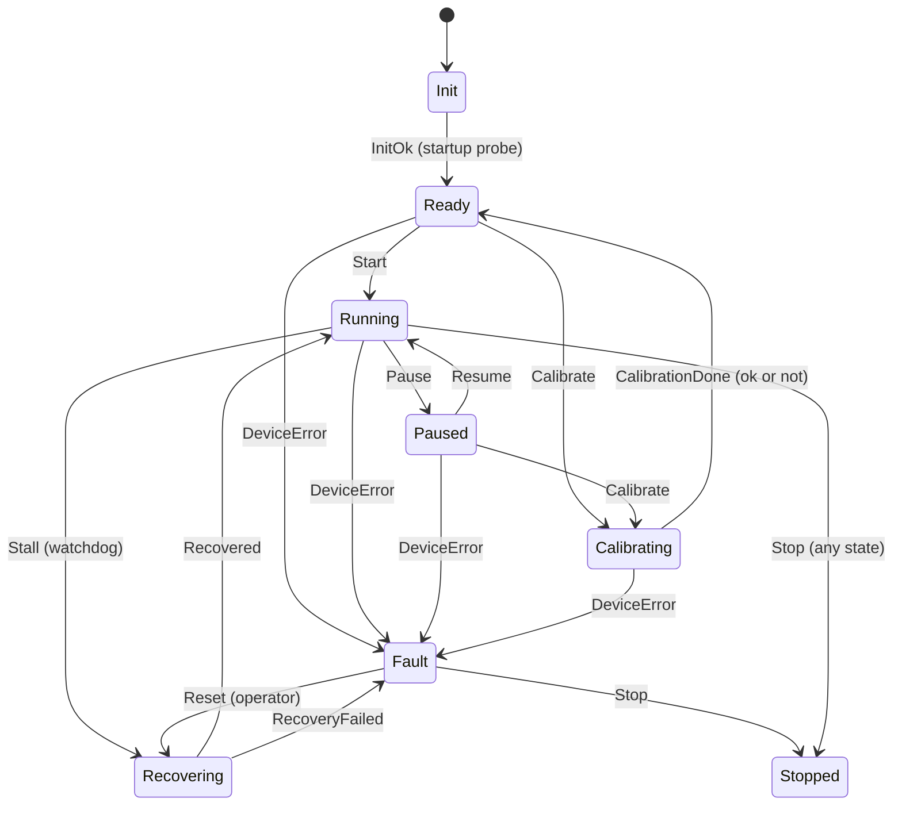

# device-service (V4, V2/M0 · M4 · M5)

C++ userspace service that consumes the kernel driver's `/dev/acq0` (see
`driver/custom-acq/`). Plan.md's V4: Device / RingBuffer /
AcquisitionWorker / Configuration / Logging / Metrics / ErrorRecovery /
systemd / GoogleTest, split across Phase 1 (the minimal end-to-end loop)
and Phase 2 (everything else).

## What it does

1. Loads `Config` (optional JSON file, see `config.example.json` — all
   fields have defaults, missing file or missing fields just fall back).
2. Opens `/dev/acq0`, reads `device_id`/`fw_version` from sysfs as a
   liveness check, notifies systemd it's ready (`sd_notify(READY=1)`,
   a no-op outside systemd).
3. Hands the device to the `Supervisor` (Plan.md V2/M5, see "Machine
   state" below), which writes `1` to the `control` sysfs attribute to
   start acquisition unless `autostart` is off.
4. `AcquisitionWorker` (its own thread) polls `/dev/acq0` and drains
   samples into a bounded `RingBuffer`, tracking sequence-number
   continuity via `SequenceTracker`.
5. `MetricsReporter` (its own thread) periodically logs a summary line
   (rate/samples/gaps/buffer occupancy/kfifo_overflow) and pings systemd's
   watchdog (`sd_notify(WATCHDOG=1)`) on the same heartbeat.
6. `Watchdog` (its own thread) watches for "no new sample in
   `liveness_timeout_ms`" while the machine is `Running`, and reports a
   stall to the `Supervisor`. Since M5 it only detects; the recovery
   policy lives in the supervisor.
7. On `SIGINT`/`SIGTERM`: the supervisor goes to `Stopped` (stopping
   acquisition, even mid-calibration or mid-recovery), then the worker,
   metrics, and watchdog threads are joined and a final report printed.
8. `BackpressureController` (Plan.md V2/M0, off by default —
   `backpressure_enabled`): its own thread polls `kfifo_overflow`; any
   movement backs `REG_SAMPLE_RATE` off (halved by default,
   `backpressure_backoff_divisor`, floored at `backpressure_min_hz`), a
   clean window steps it back up (`backpressure_recovery_step_hz`)
   toward `backpressure_target_hz`. Verified on real hardware recovering
   a deliberately-forced 3000Hz overload back to a stable, loss-free
   1000Hz in ~6 seconds — see `docs/performance.md`'s "M0: Backpressure"
   section.
9. **The leading signal** (added 2026-09-20). `kfifo_overflow` only moves
   once data is already gone. Two signals move while the pipeline is
   merely straining, and either one now produces a `Congestion::Warning`:
   one gentle step down instead of a halving, and no ramping up.
   - `backpressure_max_sample_age_us` — how old a sample already is when
     userspace reads it (`now - irq_ts_ns`), i.e. how long it waited in
     the driver's kfifo. This is the driver/SPI side falling behind.
   - `backpressure_max_devbus_pressure` — the deepest devbus subscriber
     queue as a fraction of its capacity. This is a *consumer* falling
     behind instead.

   Both are off by default (`0`). Sample age is reported on the metrics
   line, so a threshold can be set against a number that has been watched
   first. It is an EWMA, not the last reading and not a window peak —
   both of those were tried on hardware and were wrong in opposite
   directions; see the comment on `AcquisitionWorker::sample_age_ewma()`.

   **Verified on hardware (2026-09-20)**: MCU started at 1250 Hz, 10 Hz
   below the cliff, threshold 1300 µs. The controller eased it to 1150
   then 1050 Hz and settled between those two, sustaining 1180 samples/s
   for 25 s with `kfifo_overflow` and `policy_dropped` both moving by
   exactly 0 — the lagging signal never fired because the leading one had
   already acted. `results/backpressure/leading-signal-20260920/`.
10. **devbus publishing** (`devbus_service`, empty by default). Only one
   process can hold `/dev/acq0`, so anything else that wants the stream
   would need this service to hand it over. Set `devbus_service` to e.g.
   `acq/samples` and every sample is republished on devbus shared memory,
   zero-copy from there on, with each consumer choosing its own overflow
   policy. `devbus-ls` shows the service; `userspace/devbus/examples/
   sample_subscriber.cpp` is a consumer to copy.

   Note that `acq-bridge` (in devbus's examples) does the same job as a
   separate process, reading `/dev/acq0` itself. Use that when you do not
   want the full service; use this when device-service is already running
   and should be the one owner of the device.

## Machine state (Plan.md V2/M5)

Before M5 each part handled its own corner: the watchdog would soft-reset
the MCU, the backpressure controller would rewrite its sample rate, and
nothing knew what the device as a whole was doing. A watchdog that knows
nothing about pauses resets the MCU straight out of one. Now one
`Supervisor` owns a single machine state, and every change goes through
one table (`src/device_state.cpp`):



- **One thread applies every event**, from a queue. Operator commands,
  watchdog stalls, the acquisition thread dying, and SIGTERM all become
  events, so a soft reset can never interleave with a calibration.
  Operator commands are checked against the current state on arrival: a
  command that is not allowed is refused with the reason, not queued.
- **A state means it is already true.** The device action behind
  `Running`/`Paused`/`Stopped` is done *before* the state is published:
  `Running` means `control=1` has been written. If the device refuses,
  the state never changes and the machine goes to `Fault` instead.
- **Recovery** (`Recovering`): probe, soft reset (`control` 0→1, which
  restarts the MCU's sequence counter and FIFO, case-05), then wait up to
  `recovery_timeout_ms` for samples. Up to `max_recovery_attempts`, with
  exponential backoff. If the acquisition thread died on a read error,
  recovery also reopens `/dev/acq0` and restarts the thread. The probe
  compares `device_id` against the value read at startup, because on
  this hardware a dead MCU does not make the read fail. It returns
  `0x00000000` (seen on the Pi on 2026-10-01, with `fw_version` failing
  with EIO next to it). The startup probe now rejects 0 and all-ones for
  the same reason; before this it logged them as "device online".
- **Fault is latched.** Only an operator `reset` (or `stop`) leaves it,
  so a flapping device can't keep cycling unnoticed. Entering `Fault`
  stops acquisition and writes **cross-layer evidence** to
  `state_dir/fault-<UTC>.json`: the service's state history and counters,
  every custom-acq sysfs attribute (a read that fails is recorded as its
  error, which is often the most telling line), and the kernel log lines
  about the driver or SPI (unavailable under the production sandbox's
  `ProtectKernelLogs=`, and recorded as unavailable). Kept to
  `evidence_keep` files.
- **Calibration** (`Calibrating`) is docs/performance.md's M3 clock-drift
  measurement as a managed procedure: run the MCU for
  `calibration_duration_ms`, fit `irq_ts_ns` against `seq` online
  (Welford co-moments; raw sums of ~1e12 ns timestamps lose the ppm in
  double precision), and write `state_dir/calibration.json` atomically.
  It refuses runs it can't trust: a sequence restart mid-run, or
  timestamps batched by a congested link (case-07). A failed calibration
  is not a fault.

**Control channel**, separate from the data path (samples on devbus,
commands here): a Unix socket at `control_socket`, one command per
connection, one line of JSON back. Peer credentials must be root or the
service's own uid. `device-ctl` (`tools/device-ctl.c`, plain C, since
BusyBox `nc` has no Unix-socket mode) is the client:

```bash
device-ctl status      # state, counters, history, last fault, last calibration
device-ctl pause | resume | start | calibrate | reset
```

`systemctl status device-service` shows the current state too
(`sd_notify(STATUS=...)`). On the A/B image the health check that
commits an updated slot asks for `"state":"Running"`, since a process
that is `active` can now be sitting in a latched `Fault`.

**On the board** (images 1.3.1/1.3.2, 2026-10-02): device-service starts
at boot `Init → Ready → Running`, the A/B health check commits a slot on
`"state":"Running"`, and in M8's `stall` scenario the supervisor took the
device from 4.26 s of silence back to Running on its first recovery
attempt. **Calibration ran and correctly refused.** On the 6.12 kernel at
1 kHz, 27.6 % of samples share an IRQ timestamp (two samples drained per
pass), and the calibrator rejects anything over 1 %, because a fit over
batched stamps measures the drain cadence, not the MCU's clock. M3's
−64.42 ppm was measured on 6.6, where every stamp was distinct. On 6.12
a calibration needs a lower rate. At 500 Hz and 250 Hz there were 0
repeated stamps, and four runs gave **+41.6, +38.9, +38.8, +38.5 ppm**: the
same at both rates, settling after the first. The sign convention differs
from M3's offline script. Here + means the MCU runs fast
(`measured/nominal − 1`); M3 used the spacing (`slope/nominal − 1`), so
its −64.42 ppm also means fast. The MCU's uncompensated RC oscillator ran
~39 ppm fast on this day against ~64 ppm on 2026-09-16, which is why
calibration is a procedure that can be re-run rather than a constant. The
data is in `results/kernel-hardening-ab/`. One rough edge, seen there:
after a calibration started from `Paused` the machine is in `Ready`, so
the operator's next command is `start`, not `resume`.

**Tested** on the development host against a simulated MCU: the real
Device/Worker/Watchdog/Supervisor classes, with `/dev/acq0` replaced by
a named pipe and sysfs by a directory of plain files
(`tests/test_supervisor.cpp`). This covers stall recovery, a dead MCU
reading zeros, the acquisition thread dying, a pause not being taken
for a stall, calibration recovering an injected −64.42 ppm, and Stop
interrupting a 60 s calibration. 60 tests in all, also clean under
ThreadSanitizer and AddressSanitizer. Writing them turned up a real bug:
`Device::wait_readable()` only looked for `POLLIN`, so a hung-up fd made
`poll()` return immediately forever. That was a 100%-CPU spin in which
the read error was never seen.

## Build

```bash
bash build.sh [Debug|Release]
```

Requires g++ (C++20), cmake, and (installed via apt on the Pi):
`libspdlog-dev`, `nlohmann-json3-dev`, `libgtest-dev`, `libsystemd-dev`.

It also links `devbus` (`userspace/devbus/`). CMake takes it from the
sysroot if it is installed there (which is what the Yocto recipes do,
`device-service` DEPENDS on `devbus`), and otherwise builds the sibling
source tree directly — so a plain checkout builds with no extra step.

Unit tests build alongside the service (`BUILD_TESTING` CMake option,
default `ON`) and run via `ctest` from the build directory:

```bash
cd build/Debug && ctest --output-on-failure
```

## Run standalone

`/dev/acq0` and the sysfs `control` attribute are root-owned by default
(a udev rule to relax that is a Phase 3+ item, not done):

```bash
sudo ./build/Debug/device-service [path/to/config.json]
```

Ctrl+C (or `SIGTERM`) shuts it down cleanly. With no config path argument
it runs entirely on defaults (`/dev/acq0`, `/sys/bus/spi/devices/spi0.0/`,
etc. — see `include/config.hpp`).

## Run under systemd

```bash
sudo mkdir -p /opt/device-service
sudo cp build/Release/device-service /opt/device-service/
sudo cp config.example.json /opt/device-service/config.json
sudo cp systemd/device-service.service /etc/systemd/system/
sudo systemctl daemon-reload
sudo systemctl enable --now device-service
sudo systemctl status device-service
journalctl -u device-service -f
```

The unit is `Type=notify` with `WatchdogSec=15`: if the process hangs
(stops sending `WATCHDOG=1` pings, which piggyback on `MetricsReporter`'s
own tick) rather than cleanly exiting, systemd kills and restarts it
(`Restart=on-failure`). Verified on hardware: `systemctl start`/`stop`/
`restart` all clean, `journalctl` shows the spdlog output, status goes
`active (running)` only after the startup liveness check succeeds and
`sd_notify(READY=1)` fires.

## Platform differences

One source tree, two targets — see [`platforms/`](../../platforms/).

- **Yocto Scarthgap (the main line):** built by the
  `recipes-apps/device-service` recipe as part of `device-platform-image`,
  not by `build.sh`; dependencies come from the layer, not from `apt`.
  Started by its systemd unit at boot.
- **Raspberry Pi OS (the comparison card):** `build.sh` natively on the
  target, dependencies via `apt` as listed above. Used for kernel
  comparisons ([case 07](../../docs/debugging/case-07-preempt-rt-comparison-exposes-a-different-bottleneck.md))
  precisely because installing a whole alternative kernel there is one
  `apt install`.

The scheduling knobs in the config (`SCHED_FIFO` priority, CPU affinity,
`mlockall`) behave the same on both, but what they are worth differs — on
a near-empty Yocto image there is much less to be preempted by. That
comparison is the reason both platforms are kept.

## Known limitations (see the plan file for the fuller Phase-by-phase list)

- Effective throughput is below the MCU's raw ~1kHz sample rate — the
  two-frame, echo-verified SPI protocol has real per-sample overhead
  (see Case 05). An honest, now-visible bottleneck, not something this
  phase tries to optimize; that's Plan.md V7's job.
- Sustained SPI traffic can stall the Pi's SPI controller badly enough to
  need a physical MCU reset — see Case 06
  (`docs/debugging/case-06-spi-controller-stall-under-sustained-load.md`,
  found via V5's integration tests). Not something `Watchdog`'s soft
  reset can recover from either (a stuck `spi_sync_transfer()` blocks the
  same SPI path `Watchdog`'s own probe would need to use).
- The supervisor's recovery is a *soft* reset only (rewriting `control` over
  SPI) — it cannot recover a link that's genuinely down (SPI echo
  mismatches / no response at all). That needs a real hardware reset
  (`tools/mcu-reset.sh`, over SWD) or a manual power-cycle; this service
  deliberately does not attempt either automatically (SWD needs a
  debugger connected, and a background service auto-triggering a
  hardware reset is a bigger blast radius than this phase wants).
- `MetricsReporter` has no tests of its own. `AcquisitionWorker`,
  `Watchdog` and `Supervisor` are covered end to end against the
  simulated MCU described above.
