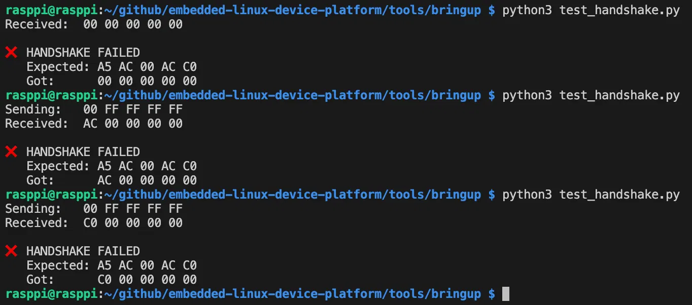
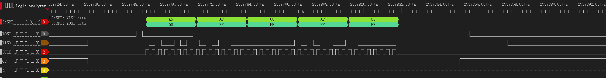

# V1.1 — SPI Slave Handshake
 
MCU (STM32F103VET6) as SPI slave, Raspberry Pi 4 as master. Pi reads the MCU's
device ID over SPI. Verified with logic analyzer.
 
## What Was Done
 
1. Wrote minimal SPI slave firmware on MCU: blocks on boot waiting for master,
   returns 5 bytes on request (1 status byte + 4 byte device ID)
2. Pi-side Python script (spidev) initiates the SPI read, checks returned data
3. Captured full SPI waveform with DSLogic Plus, confirmed protocol timing
## Protocol
 
One transaction = 5 bytes, full-duplex:
 
```
Master sends:  [CMD 0x00] [FF] [FF] [FF] [FF]       ← command + 4 dummies
Slave returns: [STS 0xA5] [AC] [00] [AC] [C0]       ← status + DEVICE_ID
```
 
DEVICE_ID = `0xAC00ACC0`, split into 4 bytes big-endian.
 
## Wiring
 
| Signal | MCU (SPI2) | Pi | DSLogic |
|--------|-----------|-----|---------|
| SCLK | PB13 | Pin 23 | CH2 |
| MISO | PB14 | Pin 21 | CH1 |
| MOSI | PB15 | Pin 19 | CH0 |
| CS   | PB12 | Pin 24 | CH3 |
| GND  | GND  | Pin 6  | GND |
 
All routed through breadboard. No VCC connection between boards.
 
## Bug Encountered
 
Direct jumper-wire clips gave random failures (all zeros, single-byte responses,
shifted data — different every run). Switched to breadboard routing, immediately
stable.

See: 
Lesson: random failures in embedded → check physical layer first.
 
 
## Waveform
 

 
40 clock edges during CS low (5 bytes × 8 bits). MISO decodes to `A5 AC 00 AC C0`.
 
---

 
# Characterization Experiments
 
| Experiment | What to do | What to observe |
|------------|-----------|-----------------|
| Mode mismatch | Pi cycles Mode 0/1/2/3, MCU stays Mode 0 | Only Mode 0 correct; others have data but all wrong |
| Speed sweep | Clock from 100 kHz to 16 MHz | Find the reliable speed ceiling of this setup |
| Length mismatch | Pi sends 1/3/5/7/10 bytes, MCU expects 5 | <5: MCU stuck; >5: trailing bytes are junk |
| Rapid stress | 1000 consecutive handshakes | Measure throughput, observe blocking-mode failure rate |
| Waveform comparison | Logic analyzer: Mode 0 vs Mode 2 | See the data-vs-clock edge relationship invert |

